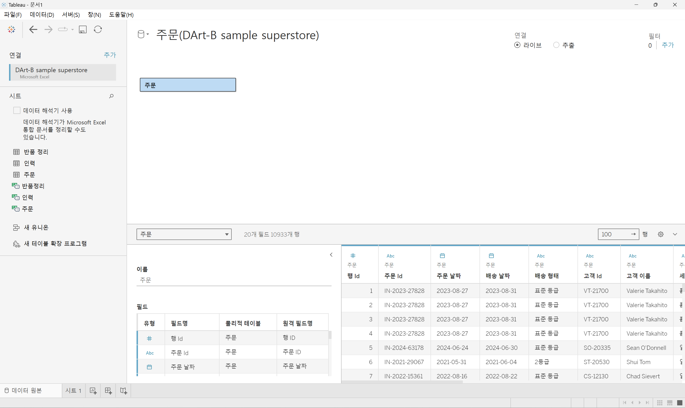
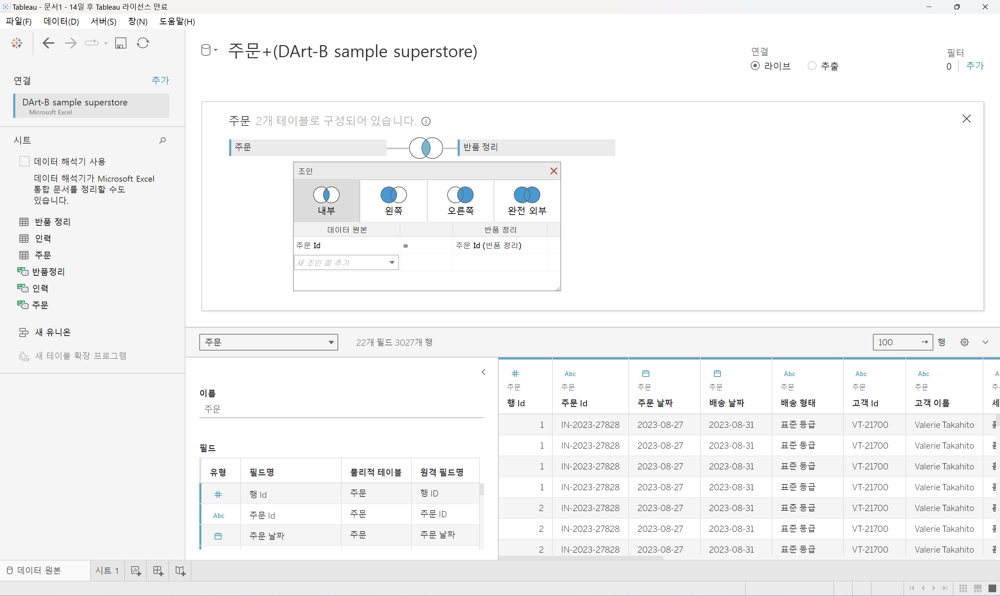

# First Study Week

- 1강: [태블로설치](#1강-태블로설치)

- 2강: [데이터연결](#2강-데이터연결)

- 3강: [데이터연결과 데이터유형](#3강-데이터연결과-데이터유형)

- 4강: [데이터결합과 관계](#4강-데이터결합과-관계)

- 5강 : [데이터결합과 조인](#5-데이터결합과-조인)

- 6강: [데이터결합 혼합](#6강-데이터결합-혼합)

- 7강: [데이터결합과 유니온](#7강-데이터-결합과-유니온)

- 8강: [라이브 및 추출](#8강-라이브-및-추출)

- 9강: [데이터형식](#9강-데이터형식)

- 문제1 : [문제1](#문제-1)

- 문제2 : [문제2](#문제-2)

- 참고자료 : [참고자료](#참고-자료)


## Study Schedule

| 강의 범위     | 강의 이수 여부 | 링크                                                                                                        |
|--------------|---------|-----------------------------------------------------------------------------------------------------------|
| 1~9강        |  ✅      | [링크](https://youtu.be/3ovkUe-TP1w?si=CRjj99Qm300unSWt)       |
| 10~19강      | 🍽️      | [링크](https://www.youtube.com/watch?v=AXkaUrJs-Ko&list=PL87tgIIryGsa5vdz6MsaOEF8PK-YqK3fz&index=75)       |
| 20~29강      | 🍽️      | [링크](https://www.youtube.com/watch?v=AXkaUrJs-Ko&list=PL87tgIIryGsa5vdz6MsaOEF8PK-YqK3fz&index=65)       |
| 30~39강      | 🍽️      | [링크](https://www.youtube.com/watch?v=e6J0Ljd6h44&list=PL87tgIIryGsa5vdz6MsaOEF8PK-YqK3fz&index=55)       |
| 40~49강      | 🍽️      | [링크](https://www.youtube.com/watch?v=AXkaUrJs-Ko&list=PL87tgIIryGsa5vdz6MsaOEF8PK-YqK3fz&index=45)       |
| 50~59강      | 🍽️      | [링크](https://www.youtube.com/watch?v=AXkaUrJs-Ko&list=PL87tgIIryGsa5vdz6MsaOEF8PK-YqK3fz&index=35)       |
| 60~69강      | 🍽️      | [링크](https://www.youtube.com/watch?v=AXkaUrJs-Ko&list=PL87tgIIryGsa5vdz6MsaOEF8PK-YqK3fz&index=25)       |
| 70~79강      | 🍽️      | [링크](https://www.youtube.com/watch?v=AXkaUrJs-Ko&list=PL87tgIIryGsa5vdz6MsaOEF8PK-YqK3fz&index=15)       |
| 80~89강      | 🍽️      | [링크](https://www.youtube.com/watch?v=AXkaUrJs-Ko&list=PL87tgIIryGsa5vdz6MsaOEF8PK-YqK3fz&index=5)        |


<!-- 여기까진 그대로 둬 주세요-->


## 1강. 태블로설치

<!-- 태블로 Desktop은 유료 혹은 사용자 인증이 되어야 하므로, 사용 경험이 없으시다면 우선 Tableau Public으로 학습하는 것을 권장드립니다. -->

## 2강. 태블로연결

> **🧞‍♀️ 데이터 해석기는 어떤 경우 사용하나요?**

```
데이터 해석기는 병합된 셀, 메모, 바닥글, 빈 셀 등을 감지하고 이를 무시하여 데이터 집합의 실제 필드와 값을 식별할 수 있게 해주는 기능으로, 분석에 불필요한 데이터를 정제하고 전처리할 때 사용된다.
```

> **🧞‍♀️ 깃허브 assignment 폴더의 DArt-B Sample Store.xls 파일을 다운받고 시트 중 '주문' 시트를 불러와주세요.**


<!-- 캡쳐 파일을 첨부해주세요! 캡쳐하는 법은 깃허브 강의 영상에 있습니다 (폴더 생성 후 폴더 안에 이미지 넣기 + 불러오기) -->

<!-- 문제와 문제 풀이가 모두 위 DArt-B Sample Store.xls 파일을 기반으로 제시되므로, 해당 엑셀파일을 사용하셔야 혼동이 없습니다. -->

## 3강. 데이터연결과 데이터 유형

> **🧞‍♀️ 라이브와 추출의 차이가 무엇인가요? 어떤 경우 사용하나요?**

```
라이브는 Tableau가 데이터 원본에 실시간으로 직접 연결하여 데이터를 가져오는 방식으로, 원본 데이터가 변경되면 시트에 즉시 반영된다. 그러나 데이터 양이 많아질수록 처리 속도와 성능이 저하될 수 있어, 온라인 환경에서 원본 데이터가 가볍고 자주 변동되는 상황에 유용하다.

반면, 추출은 데이터 원본을 hyper 파일로 저장해 사용하며, 원본 데이터가 변경되면 새로고침을 통해 추출 데이터를 최신 상태로 유지한다. 이로 인해 오프라인 작업이 가능하고, 라이브보다 처리 속도가 빠르기 때문에 대량의 데이터를 다루기에 적합하다.
```

## 4강. 데이터결합과 관계

<!-- 데이터 결합과 관계에 대해 알게 된 점을 자유로이 적어보세요.-->
```
관계로 결합된 데이터는 조인으로 결합된 데이터보다 동적이고 유연하게 연결된다는 점에서 차이가 있다.
```

> **🧞‍♀️ 어떤 경우에 관계를, 어떤 경우에 조인을 사용하나요?**

```
관계의 경우, 여러 테이블 간의 논리적 연결을 통해 각 테이블을 독립적으로 유지하면서 필요할 때만 데이터를 결합하는 방식으로, 데이터 간의 유형이 동일할 때, 즉 각 테이블에서 공통된 필드 값을 기준으로 데이터를 결합한다.

조인의 경우, 제어 혹은 의도적인 필터링, 복제를 위해 여러 테이블을 물리적으로 결합하는 방식을 취한다.
```

## 5강. 데이터결합과 조인

<!-- 데이터 결합과 조인에 대해 알게 된 점을 적고, 아래 질문에 답해보세요 :) -->
```
Inner 조인: 두 데이터 소스에서 공통된 필드의 값이 일치하는 행만 결합한다.
Left 조인: 왼쪽 데이터 소스의 모든 행과 오른쪽 데이터 소스에서 일치하는 행을 결합한다.
Right 조인: 오른쪽 데이터 소스의 모든 행과 왼쪽 데이터 소스에서 일치하는 행을 결합다.
Outer 조인: 모든 데이터 소스의 행을 포함한다. 두 데이터 소스에서 일치하지 않는 값은 NULL로 표시된다.
```

주문 중 '반품된' 주문만을 가지고 분석을 진행하려고 합니다.

> **🧞‍♀️ 해당 목적 달성을 위해서 Sample store 데이터셋의 어떤 시트를 조인(혹은 릴레이션)해야 할까요? 조인키는 무엇인지, (inner, outer, left, right) 조인 유형은 무엇일지 논의해주세요.**

데이터를 조인한 데이터 원본 창의 캡쳐를 첨부해주세요.
몇 개의 주문이 반품되었다고 표시되나요?

<!-- 캡쳐 이미지를 첨부해주세요 -->


```
주문 시트와 반품 정리 시트에서 주문 ID를 기준으로, 양쪽 시트에 해당 필드의 데이터가 모두 존재하는 경우에만 결과값을 출력하는 inner 조인을 사용하여 반품된 주문을 추출하였다. 그 결과, 총 3027개의 주문이 반품된 것으로 확인되었다.
```

## 6강. 데이터결합 혼합

<!-- 데이터결합 및 혼합에 대해 알게 된 점을 적어주세요 -->
```
혼합의 경우, 관계나 조인과 달리 데이터를 실제로 결합하지 않고, 각 데이터 원본을 독립적으로 집계한 후 한 시트에서 데이터를 시각화할 수 있도록 하는 방식이다. 이를 통해 데이터 원본 간의 물리적 결합 없이, 서로 다른 데이터셋을 동시에 분석하고 시각화할 수 있다.
```

## 7강. 데이터 결합과 유니온

<!-- 유니온에 대해 알게 된 점을 적어주세요 -->
```
유니온은 한 테이블의 행을 다른 테이블에 추가하여 데이터를 결합하는 방법이다.
```

> **🧞‍♀️ 유니온을 사용하기 위한 전제 조건은 무엇인가요?**

```
데이터를 유니온으로 결합하기 위해서는 데이터의 테이블 구조가 동일해야 한다. 각 테이블의 필드 수가 같고, 관련 필드의 필드 이름과 데이터 유형이 일치해야 한다.
```

## 8강. 라이브와 추출

<!-- 라이브와 추출에 대해 알게 된 점을 적어주세요 -->
```
라이브와 추출 방법의 차이점은 데이터의 실시간 업데이트이다.
```

> **🧞‍♀️ 라이브와 추출 방법의 차이가 무엇인가요? 어떤 경우에 추출을 사용하면 좋을까요?**

```
라이브 연결은 데이터 원본의 변경사항이 Tableau에 반영되어 실시간으로 정보가 업데이트된다. 반면, 추출의 경우 로컬 데이터나 온프레미스 데이터와 관계없이 원본 데이터에서 업데이트를 수신하려면 추출을 매번 새로 고쳐주어야 한다. 

따라서 추출은 특히 대규모 데이터셋이나 복잡한 필터, 계산 등이 포함된 시각화에서 라이브 연결보다 빠르게 처리되는 경향이 있어 훨씬 유용하다.
```

**참고자료 : 온프레미스 데이터란?**

기업이나 조직이 자체적으로 보유한 물리적 서버나 데이터 센터 내에서 직접 관리하는 데이터로, 조직 내의 하나 이상 서버에서 통제됩니다. 본 서버들은 기업의 데이터센터나 물리적 위치에 설치되어 있으며, 네트워크를 통해 해당 데이터에 접근하고 관리할 수 있습니다.

## 9강. 데이터형식

<!-- 데이터형식에 대해 알게 된 점을 적어주세요 -->
```
- 필터: 데이터 원본 페이지 오른쪽 상단에서 추가, 편집, 삭제 가능
- #: 숫자(실수), 숫자(정수)
- 달력: 날짜 및 시간, 날짜
- Abc: 문자열
- T|F: 부울
- 지구본: 지리적 역할

Tableau에서 데이터 형식을 변경할 수 있게 해놓은 이유는, 데이터를 가져올 때 데이터 형식이 잘못 인식될 수 있기 때문이다.
```

## 문제 1.

용웅이는 아래 사진과 같이 2024년 3월부터 7월까지의 지하철 승하차 이용객 데이터를 가지고 있습니다. 월별로 데이터셋이 나누어진 상태며, 용웅이는 해당 데이터셋 5개 모두를 한 번에 시각화하려 합니다. 필드 값(컬럼)의 이름, 데이터 유형, 개수는 모두 같습니다.


 이때, '조인, 관계, 혼합, 유니온' 중 본 목적에 적합한 결합 방법은 무엇인가요? 하나씩 드래그하지 않고, 와일드카드를 이용해 모든 데이터를 빠르게 결합해보세요.

<!-- 텍스트 및 이미지로 문제 풀이 과정을 기술해주세요 -->

```
각 파일이 동일한 구조를 가지고 있기 때문에, 동일한 필드를 가진 여러 데이터셋을 병합할 때 사용하는 유니온을 통해 3월부터 7월까지의 데이터를 결합하여 분석하는 것이 적합하다.

이때, 와일드카드를 이용해 데이터를 결합하려면, 포함 일치 패턴에 CARD_SUBWAY_MONTH_2024*를 입력하여 실행하면 된다.
```

## 문제 2.

상원이는 태블로를 사용하여 회사의 매출 데이터를 시각화하려고 합니다. 태블로에서는 데이터를 연결하는 두 가지 방식인 **라이브 연결과 추출 연결**이 있습니다. 두 방식 중 어떤 것을 사용할지 고민 중입니다.

다음의 일상생활 사례를 바탕으로, 어떤 상황에서 라이브 연결이 적합하고, 어떤 상황에서 추출 연결이 더 적합한지 설명하세요.

1. 사례 1: 실시간 주식 시세 확인
주식 거래를 하고 있는 수금의왕 상원이는 주식 시세가 매 순간 변동하는 실시간 데이터를 필요로 합니다. 이 데이터를 기반으로 빠르게 결정을 내려야 합니다.

```
주식 거래를 위해 실시간 데이터가 필요한 상황에서는, 데이터 원본과 직접 연결되어 변경된 데이터가 실시간으로 반영되는 라이브 연결이 적합하다.
```

2. 사례 2: 상원이는 저번 주 제주도로 여행을 갔었어요. 비행 중에 예산 계획을 세우려 하는데, 인터넷 연결이 불안정할 것 같아요. 여행 전 미리 예산 데이터를 다운로드해서 오프라인에서도 사용할 수 있으면 좋겠습니다.

```
인터넷 연결이 불안정한 상황에서는, 개별적으로 저장한 데이터를 활용해 오프라인 상태에서도 작업할 수 있는 추출 연결이 적합하다.
```

## 참고 자료

데이터 분석을 하다보면 지역별로 경향을 알아보고자 할 때가 많습니다.

태블로에서는 시/도, 시군구명을 칼럼으로 가지고 있고, 그걸 지리적 위치로 바꿔주면 지도에서 위치를 인식하는데요.
하지만 읍면동(행정동) 단위까지 인식하지는 못합니다.

그럼 어떻게 읍면동 단위까지 세분화하여 표기할 수 있을까요?

이때 방금 배운 데이터 릴레이션 혹은 조인을 사용합니다.
맵 그래프는 지금 배울 부분은 아니지만, 데이터 병합에 관련된 부분이기에 필요하신 분들을 위해 아래 링크를 걸어두겠습니다.


바로 읍면동의 경계를 가지고 있는 shp, geojson 등 공간파일을 원본데이터와 머지하는 것입니다.

링크: https://subinze.tistory.com/m/2
