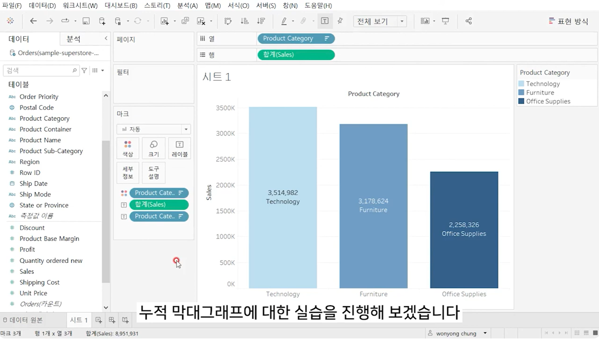

# Second Study Week

- 10강: [차원과 측정값](#10강-차원과-측정값)

- 11강: [시각화](#11강-시각화)

- 12강: [막대그래프](#12강-막대그래프)

- 13강: [누적막대그래프](#13강-누적막대그래프)

- 14강: [병렬막대그래프](#14강-병렬막대그래프)

- 15강: [누적병렬막대그래프](#15강-누적병렬막대그래프)

- 16강: [라인그래프](#16강-라인그래프)

- 17강: [맵작성](#17강-맵작성)

- 18강: [텍스트테이블](#18강-텍스트테이블)

- 19강: [트리맵과 하이라이트테이블](#19강-트리맵과-하이라이트테이블)

- 문제1 : [문제1](#문제1)

- 문제2 : [문제2](#문제2)

- 참고자료 : [참고자료](#참고-자료)


## Study Schedule

| 강의 범위     | 강의 이수 여부 | 링크                                                                                                        |
|--------------|---------|-----------------------------------------------------------------------------------------------------------|
| 1~9강        |  ✅      | [링크](https://youtu.be/3ovkUe-TP1w?si=CRjj99Qm300unSWt)       |
| 10~19강      | ✅      | [링크](https://www.youtube.com/watch?v=AXkaUrJs-Ko&list=PL87tgIIryGsa5vdz6MsaOEF8PK-YqK3fz&index=75)       |
| 20~29강      | 🍽️      | [링크](https://www.youtube.com/watch?v=AXkaUrJs-Ko&list=PL87tgIIryGsa5vdz6MsaOEF8PK-YqK3fz&index=65)       |
| 30~39강      | 🍽️      | [링크](https://www.youtube.com/watch?v=e6J0Ljd6h44&list=PL87tgIIryGsa5vdz6MsaOEF8PK-YqK3fz&index=55)       |
| 40~49강      | 🍽️      | [링크](https://www.youtube.com/watch?v=AXkaUrJs-Ko&list=PL87tgIIryGsa5vdz6MsaOEF8PK-YqK3fz&index=45)       |
| 50~59강      | 🍽️      | [링크](https://www.youtube.com/watch?v=AXkaUrJs-Ko&list=PL87tgIIryGsa5vdz6MsaOEF8PK-YqK3fz&index=35)       |
| 60~69강      | 🍽️      | [링크](https://www.youtube.com/watch?v=AXkaUrJs-Ko&list=PL87tgIIryGsa5vdz6MsaOEF8PK-YqK3fz&index=25)       |
| 70~79강      | 🍽️      | [링크](https://www.youtube.com/watch?v=AXkaUrJs-Ko&list=PL87tgIIryGsa5vdz6MsaOEF8PK-YqK3fz&index=15)       |
| 80~89강      | 🍽️      | [링크](https://www.youtube.com/watch?v=AXkaUrJs-Ko&list=PL87tgIIryGsa5vdz6MsaOEF8PK-YqK3fz&index=5)        |


<!-- 여기까진 그대로 둬 주세요-->
<!-- 이 안에 들어오는 텍스트는 주석입니다. -->

# Second Study Week

## 10강: 차원과 측정값

<!-- 차원과 측정값에 관해 배우게 된 점을 적어주세요 -->
```
불연속형은 개별적으로 구분되는 값인 반면 연속형은 단절이 없는 무한한 범위의 값이다. (예시: 불연속형 - 디지털 시계 / 연속형 - 아날로그 시계)
```

> **🧞‍♀️ 차원과 측정값의 고유한 특성에 대해 설명해주세요.**

```
차원으로 분류되는 데이터는 이름이나 카테고리처럼 집계되거나 개선되지 않는 정성적 값이며, 독립적인 필드를 의미한다. 반면, 측정값으로 분류되는 데이터는 매출, 수익, 수령처럼 정량적인 수치로, 집계될 수 있는 값을 가진다. 따라서, 기본적으로 차원은 불연속형 필드로, 측정값은 연속형 필드로 구분된다.
```

*Quiz: 차원은 불연속형이고, 측정값은 연속형이다. (o, **x**)*
```
-> 서로 다른 개념으로 통합해서 생각하면 안 된다. 시각화하고자 하는 방식에 따라서 연속형과 불연속형 두 가지 필드를 모두 활용할 수 있다.
```

## 11강: 시각화

<!-- 시각화 관해 배우게 된 점을 적어주세요 -->
```
Tableau는 동일한 데이터를 사용하더라도 다양한 시각화 방법을 지원하며, 별다른 작업 없이도 처음과 측정값에 따라서 데이터를 가장 효과적으로 표현할 수 있는 시각화 방식을 자동으로 제시한다.
```

*Quiz: 차원은 대부분 불연속형이며 표 형태로 시각화했을 때 머리글로 표시되고, 측정값은 대부분 연속형이므로 표 형태로 시각화 진행했을 때 패널로 추가된다. (**o**, x)*

## 12강: 막대그래프

<!-- 막대그래프에 관해 배우게 된 점을 적어주세요 -->
```
막대그래프는 여러 범주의 데이터를 비교할 때 유용하게 활용될 수 있다.

Tableau에서 막대그래프를 효과적으로 시각화하려면, 정렬 순서를 설정하고, 행과 열을 바꾸거나 카테고리 필드를 마크 창의 색상, 크기, 레이블에 드래그 앤 드롭하여 시각적 요소를 조정할 수 있다.
```

## 13강: 누적막대그래프

<!-- 누적막대그래프에 관해 배우게 된 점을 적어주세요 -->
```
누적막대그래프는 차원별로 측정값의 비중을 보여주기 위한 목적으로 사용되며, 축을 활용하여 구성비의 변화를 제공할 수 있다.
```

<!-- 테이블(아래로)과 테이블(옆으로)의 계산 방식을 습득해보세요. 이에 관련해 아래 참고자료도 있습니다 :) -->
```
Tableau에서 테이블(아래로), 테이블(옆으로) 계산 방식은 차원 데이터가 테이블 안에서 어떻게 배치되어 있는지에 따라 계산이 진행되는 방식을 의미한다. 테이블(아래로)은 데이터가 열을 따라 위에서 아래로, 즉 세로 방향으로 계산되고, 테이블(옆으로)은 데이터가 행을 따라 왼쪽에서 오른쪽으로, 즉 가로 방향으로 계산된다.
```

## 14강: 병렬막대그래프

<!-- 병렬막대그래프에 관해 배우게 된 점을 적어주세요 -->
```
병렬막대그래프는 기본 막대그래프를 그룹화하여 나타내는 차트이다. 

Tableau에서 병렬막대그래프를 그릴 때는 필드를 연속형으로 설정해야 각 막대의 수평 위치를 고정하여 그룹을 형성할 수 있다. 이를 위해 불연속형 필드를 연속형으로 변경할 때는 레이블 원본에서 데이터 유형을 바꾸기보다는 표시하려는 뷰에서 변경하는 것이 더 효과적이다.
```


> *🧞‍♀️ 끊어진 색상으로 배치되어 표현되는 경우와 이어지는 그라데이션 색으로 표현되는 경우 두 가지가 있습니다. 위 사진의 경우 왜 색깔이 끊어지는 색상으로 표시되지 않고 그라데이션으로 표시되었나요? 데이터의 특성과 관련하여 이야기해 봅시다.*

```
위 사진에서 색상이 끊어지지 않고 그라데이션으로 표현된 이유는 주문 일자 데이터의 연속형 필드인 월을 색상으로 사용했기 때문이다. 연속형 필드는 값의 흐름을 인지할 수 있도록 해주며, 데이터 간의 차이가 점진적으로 변화하는 특성 덕분에 색상도 자연스럽게 그라데이션으로 표시되는 것이다.
```

## 15강: 누적병렬막대그래프

<!-- 누적병렬막대그래프에 관해 배우게 된 점을 적어주세요 -->
```
누적병렬막대그래프에서는 필드 기준을 연속형과 불연속형으로 나누는 의미가 크게 없다.
```


> *🧞‍♀️ 위 사진에서는 Profit과 Sales를 측정값으로 두었습니다.  개별 칼럼(태블로에서는 #필드라 명칭합니다)을 열/행에 두는 대신, '측정값'을 사용하고 측정값 선반에 필드를 올려둡니다. 이런 방식을 사용하는 이유가 무엇일지, 어떻게 사용할 수 있을지 고민해보세요*

```
해당 사진처럼 측정값 선반에 필드를 올려 누적 병렬 막대그래프를 사용하는 이유는 여러 측정값을 한 그래프에서 비교하여 데이터를 효율적으로 시각화할 수 있기 때문이다. 이를 통해 각 측정값의 흐름을 동시에 분석함으로써 데이터 간의 변화 양상을 쉽게 파악할 수 있다.
```

<!-- 정답은 없습니다 -->

## 16강: 라인그래프

<!-- 라인그래프에 관해 배우게 된 점을 적어주세요 -->
```
라인그래프는 데이터의 시간별 추세를 확인하거나 해당 데이터를 통해 미랫값을 예측하려는 경우에 많이 사용된다.

Tableau는 열에 날짜 필드가 있으면 자동으로 라인그래프가 완성된다.
```

## 17강: 맵작성

<!-- 맵차트 관해 배우게 된 점을 적어주세요 -->
```
경도와 위도 좌표를 포함한 위치 데이터가 있으면 Tableau의 지리적 역할 기능을 통해 간단히 지도를 그릴 수 있다. 우리나라의 경우, 시도와 시군구까지만 지원되기 때문에 더 하위의 행정구역을 표현하려면 해당 구역의 공간 파일을 Tableau에 별도로 연결해야 한다.

맵의 여러 계층에 지리적 데이터를 추가할 때는 마크 계층을 활용할 수 있다. 마크 계층은 투명 오버레이처럼 작동하며, 각 계층은 고유한 마크, 캡션, 색상 등을 가질 수 있다.
```

## 18강: 텍스트테이블

<!-- 텍스트테이블에 관해 배우게 된 점을 적어주세요-->
```
텍스트테이블은 일반적으로 보는 표 형식으로, Tableau에서는 행과 열 선반에 차원을 배치하여 텍스트테이블을 생성한다.

Tableau에서는 계산식을 이용해 새로운 필드를 만들 수 있지만, 기본적으로 총계를 자동으로 계산하여 분석에 활용할 수 있도록 지원한다.
```

## 19강: 트리맵과 하이라이트테이블

> *🧞‍♀️하이라이트 테이블 등에서 두개 이상의 측정값을 사용하는 경우, 함께 색을 표현하게 되면 단위가 달라 정확한 값을 표현할 수 없습니다. 이때 클릭해야 하는 항목은?*

```
마크 창에서 색상이 포함된 측정값을 마우스 오른쪽 클릭한 후 '별도의 범례 사용'을 선택하면 각 측정값에 대해 개별적으로 색상이 적용된다.
```

## 문제1

지민이는 superstore의 한국 수출 관리 업무를 맡고 있습니다. 국가/지역이 우리나라, 즉 'South Korea'인 데이터만을 필터링하여, 상품 하위범주 별로 각 하위범주가 매출의 비율 중 얼마만큼을 차지하는지를 트리맵으로 확인하고 싶습니다. 트리맵의 각 네모 안에 표시되는 텍스트에는 **해당 범주의 이름과 전체에서 해당 범주가 차지하는 비율**이 표시되었으면 합니다.

지민이를 도와주세요! (풀이를 찾아가는 과정을 기술해주세요)

```
1. Tableau에서 '국가/지역' 필드를 드래그하여 필터 선반에 올리고, 한국을 선택해 해당 국가의 데이터만 필터링한다.
2. '하위 범주' 필드를 마크 창의 레이블로, '매출' 필드는 색상과 크기에 드래그하여 트리맵을 만든다.
3. 각 하위범주별 매출 비중을 표현하기 위해 '매출' 필드를 마크 창의 레이블로 드래그한 후, 해당 측정값을 마우스 오른쪽 클릭하여 퀵 테이블 계산을 선택하고 구성 비율을 적용한다.
```

## 문제2

주현이는 국가/지역별로 매출과 수익의 증감을 시간에 흐름에 따라 표현하고자 합니다. 특히 **한국/중국/일본**을 비교하고자 해당 3국을 남기고 필터링했고, 3개 국가를 매출과 수익이라는 두 가지 지표로 확인해보았습니다.

아래는 위 설명을 표현해본 예시입니다.


레퍼런스와 꼭 같지 않아도 자유롭게 표현하고, 그 과정을 기술해주세요.

```
1. '국가/지역' 필드를 열에 추가한 후, 우클릭하여 필터에서 한국, 중국, 일본을 선택한다.
2. '주문 날짜' 필드를 열에 드래그한 후, 마우스 우클릭하여 데이터 유형을 월로 설정하고, 연속형으로 변경하여 매출과 수익의 증감을 시간의 흐름에 따라 표현될 수 있도록 한다.
3. '매출'과 '수익' 필드를 각각 행에 추가한 뒤, 이중 축을 선택하고 두 축을 동기화하여 국가별 매출과 수익을 비교하는 라인 그래프를 생성한다.
4. 합계(매출) 색상 마크에 '매출' 필드를 드래그하여 파란색 계열의 그라데이션을 적용하고, 합계(수익) 색상 마크에는 '수익' 필드를 추가하여 붉은색 계열의 그라데이션으로 시각적으로 구분되도록 설정한다.
```

### 참고 자료 1

테이블 계산에서 '다음을 사용하여 계산'에는 테이블 당 계산과 패널 당 계산이 있습니다. 이에 대해 이해하는 것이 꼭 필요하기 때문에, 외부 레퍼런스를 참고하여 이 단계에서 꼭! 학습 후, 넘어가주세요 :)


[참고 외부자료 링크는 여기를 클릭하십시다](https://velog.io/@eunsuh/Tableau-%EB%A0%88%EB%B2%A8UP-%EA%B0%95%EC%9D%98-%EC%A0%95%EB%A6%AC-1-%ED%85%8C%EC%9D%B4%EB%B8%94-%EA%B3%84%EC%82%B0)

### 참고 자료 2

수익의 경우, 마이너스가 표시될 수 있습니다.