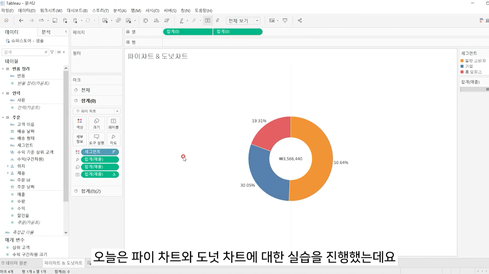

# Third Study Week

- 20강: [파이와 도넛차트](#20강-파이와-도넛차트)

- 21강: [워드와 버블차트](#21강-워드와-버블차트)

- 22강: [이중축과 결합축](#22강-이중축과-결합축)

- 23강: [분산형 차트](#23강-분산형-차트)

- 24강: [히스토그램](#24강-히스토그램)

- 25강: [박스플롯](#25강-박스플롯)

- 26강: [영역차트](#26강-영역차트)

- 27강: [간트차트](#27강-간트차트)

- 28강: [필터](#28강-필터)

- 29강: [그룹](#29강-그룹)


- 문제1 : [문제1](#문제1)

- 문제2 : [문제2](#문제2)

- 참고자료 : [참고자료](#참고-자료)


## Study Schedule

| 강의 범위     | 강의 이수 여부 | 링크                                                                                                        |
|--------------|---------|-----------------------------------------------------------------------------------------------------------|
| 1~9강        |  ✅      | [링크](https://youtu.be/3ovkUe-TP1w?si=CRjj99Qm300unSWt)       |
| 10~19강      | ✅      | [링크](https://www.youtube.com/watch?v=AXkaUrJs-Ko&list=PL87tgIIryGsa5vdz6MsaOEF8PK-YqK3fz&index=75)       |
| 20~29강      | ✅      | [링크](https://www.youtube.com/watch?v=Qcl4l6p-gHM)      |
| 30~39강      | 🍽️      | [링크](https://www.youtube.com/watch?v=e6J0Ljd6h44&list=PL87tgIIryGsa5vdz6MsaOEF8PK-YqK3fz&index=55)       |
| 40~49강      | 🍽️      | [링크](https://www.youtube.com/watch?v=AXkaUrJs-Ko&list=PL87tgIIryGsa5vdz6MsaOEF8PK-YqK3fz&index=45)       |
| 50~59강      | 🍽️      | [링크](https://www.youtube.com/watch?v=AXkaUrJs-Ko&list=PL87tgIIryGsa5vdz6MsaOEF8PK-YqK3fz&index=35)       |
| 60~69강      | 🍽️      | [링크](https://www.youtube.com/watch?v=AXkaUrJs-Ko&list=PL87tgIIryGsa5vdz6MsaOEF8PK-YqK3fz&index=25)       |
| 70~79강      | 🍽️      | [링크](https://www.youtube.com/watch?v=AXkaUrJs-Ko&list=PL87tgIIryGsa5vdz6MsaOEF8PK-YqK3fz&index=15)       |
| 80~89강      | 🍽️      | [링크](https://www.youtube.com/watch?v=AXkaUrJs-Ko&list=PL87tgIIryGsa5vdz6MsaOEF8PK-YqK3fz&index=5)        |


<!-- 여기까진 그대로 둬 주세요-->
<!-- 이 안에 들어오는 텍스트는 주석입니다. -->

# Third Study Week

## 20강: 파이와 도넛차트
<!-- 파이와 도넛차트에 관해 배우게 된 점을 적어주세요 -->
```
파이 차트는 전체에 대한 비율을 표시할 때 주로 사용된다.

도넛 차트는 기존의 파이 차트 위에 작은 원을 추가하여, 내부를 비워둔 형태로 시각화한 것이다.
```

> **🧞‍♀️ 도넛차트를 생성하는 법을 기록해주세요.**
```
1. 열 선반에 빈 공간에 0을 입력하여 임의의 축을 만든다.
2. 생성한 필드를 컨트롤 키를 누른 채 옆으로 드래그하면 두 개의 원이 생성된다.
3. 분리된 파이 차트 표현을 위해 두 번째 마크에 포함된 값을 제거한다.
4. 레이블에 값을 추가하고, 사이즈를 조정하여 양쪽 파이 차트의 크기를 맞춘다.
5. 상단의 두 번째 필드를 클릭하거나 역삼각형 표시를 클릭하여 이중 축을 선택하면 도넛 차트가 완성된다.
```

## 21강: 워드와 버블차트
<!-- 워드와 버블차트에 관해 배우게 된 점을 적어주세요 -->
```
버블 차트는 수치적 데이터를 원의 크리로 표현하는 차트이다.

워드 클라우드는 문서 내에서 등장하는 키워드가 얼마나 자주 등장하는지를 텍스트 크기로 표현하여 직관적으로 시각화할 수 있는 차트이다.
```

## 22강: 이중축과 결합축
<!-- 이중축과 결합축에 관해 배우게 된 점을 적어주세요 -->
```
이중 축은 하나의 뷰어 안에서 축을 이중으로 사용하는 차트이다. 이중 축을 쓸 경우에는 마크를 각각의 축에 개별적으로 적용할 수 있다.

결합된 축은 하나의 축을 공유하는 차트이다. 축을 공유하는 측정값을 필요에 따라 추가할 수 있다.
```

## 23강: 분산형 차트
<!-- 분산형 차트에 관해 배우게 된 점을 적어주세요 -->
```
분산형 차트는 파라미터 간의 상관관계를 파악하는데 유용한 그래프이다.

-> 분산형 차트에 범주별 추세선을 추가하려면, 왼쪽 상단에서 분석 탭으로 전환한 후, 모델의 추세선을 시트에 드래그하여 선형 영역에 드랍한다.
-> 전체 추세를 파악하고 싶다면, 열 선반에서 시트의 추세선을 마우스 오른쪽 클릭하고 추세선 편집을 선택한 뒤, 요소에서 범주의 체크를 해제한다.
-> 각각의 추세선을 한 뷰에서 보고 싶다면, 열 선반에서 필드를 컨트롤 키를 누른 채 옆으로 드래그하여 복사한다. 그런 다음, 복사한 필드 중 하나의 추세선을 우클릭하고 모든 추세선 편집을 선택한 후, 범주 차원을 클릭하여 활성화한다. 이후 열 선반에서 필드를 마우스 오른쪽 클릭하고 이중 축을 선택한다. 마지막으로 추가로 생성된 머리글을 우클릭하여 머리글 표시를 해제하여 정리한다.
```

## 24강: 히스토그램
<!-- 히스토그램에 관해 배우게 된 점을 적어주세요 -->
```
히스토그램은 데이터의 분포 형태를 시각적으로 나타내는 차트이다. 형태는 막대그래프와 유사하지만, 불연속형이 아닌 연속형 측정값을 범위 또는 구간 차원으로 그룹화한다는 점에서 차별화된다. 또한, 히스토그램에서는 막대와 막대 사이가 붙어 있는 반면, 막대그래프는 막대와 막대 사이에 공백이 존재한다. 

히스토그램은 차원 필드 없이 측정값만으로 그래프를 그릴 때 주로 사용하는 표현 방식이다. Tableau에서는 구간 차원의 생성 여부에 따라 두 가지 방법으로 히스토그램을 생성할 수 있다.
1. 수동 생성: 사용자가 원하는 구간 차원을 수동으로 설정하여 히스토그램을 만들 수 있다. 이 경우, 사용자는 측정값을 바탕으로 원하는 구간을 정의한 후, 해당 구간을 열 선반에 배치하여 히스토그램을 생성다.
2. 자동 생성: Tableau에서 측정값을 열 선반에 드래그한 후, 우측의 표현 방식에서 히스토그램을 클릭하면 기본적으로 히스토그램이 자동으로 생성된다. 이때 Tableau는 데이터에 맞게 적절한 구간을 자동으로 설정해 준다.
```

## 25강: 박스플롯
<!-- 박스플롯에 관해 배우게 된 점을 적어주세요 -->

```
박스 플롯은 데이터의 분포를 파악하는 데 사용하는 그래프이다.
```

## 26강: 영역차트
<!-- 영역차트에 관해 배우게 된 점을 적어주세요 -->
```
영역 차트는 라인과 축 사이의 공간이 색상으로 채워진 라인 차트이다. 영역을 색상으로 채우는 차트이기에 주로 연속형 데이터의 누계를 표현하는 데 사용된다. 
```

## 27강: 간트차트
<!-- 간트차트에 관해 배우게 된 점을 적어주세요 -->
```
간트 차트는 주로 시간 경과에 따른 기간을 시각화하는데 사용된다. 


```

## 28강: 필터
<!-- 필터에 관해 배우게 된 점을 적어주세요 -->
```

```

## 29강: 그룹
<!-- 그룹에 관해 배우게 된 점을 적어주세요 -->
```

```

## 문제 1.

```js
유정이는 superstore 데이터셋에서 '주문' 테이블을 보고 있습니다.
1) 국가/지역 - 시/도- 도시 의 계층을 생성했습니다. 계층 이름은 '위치'로 설정하겠습니다.
2) 날짜의 데이터 타입을 '날짜'로 바꾸었습니다.

코로나 시기의 도시별 매출 top10을 확인하고자
1) 배송 날짜가 코로나시기인 2021년, 2022년에 해당하는 데이터를 필터링했고
2) 위치 계층을 행으로 설정해 펼쳐두었습니다.
이때, 매출의 합계가 TOP 10인 도시들만을 보았습니다.
```


```
겉보기에는 전체 10개로, 잘 나온 결과처럼 보입니다. 그러나 유정이는 치명적인 실수를 저질렀습니다.
오늘 배운 '컨텍스트 필터'의 내용을 고려하여 올바른 풀이 및 결과를 구해주세요.
```

<!-- DArt-B superstore가 아닌 개인 superstore 파일을 사용했다면 값이 다르게 표시될 수 있습니다.-->

## 문제 2.

```js
태영이는 관심이 있는 제품사들이 있습니다. '제품 이름' 필드에서 '삼성'으로 시작하는 제품들을 'Samsung group'으로, 'Apple'으로 시작하는 제품들을 'Apple group'으로, 'Canon'으로 시작하는 제품들을 'Canon group'으로, 'HP'로 시작하는 제품들을 'HP group', 'Logitech'으로 시작하는 제품들을 'Logitech group'으로 그룹화해서 보려고 합니다. 나머지는 기타로 설정해주세요. 이 그룹화를 명명하는 필드는 'Product Name Group'으로 설정해주세요.

(이때, 드래그보다는 멤버 찾기 > 시작 문자 설정하여 모두 찾아 한번에 그룹화해 확인해보세요.)
```


```js
해당 그룹별로 어떤 국가/지역이 주문을 많이 차지하는지를 보고자 합니다. 매출액보다는 주문량을 보고 싶으므로, 주문Id의 카운트로 계산하겠습니다.

기타를 제외하고 지정한 5개의 그룹 하위 목들만을 이용해 아래와 같이 지역별 누적 막대그래프를 그려봐주세요.
```


