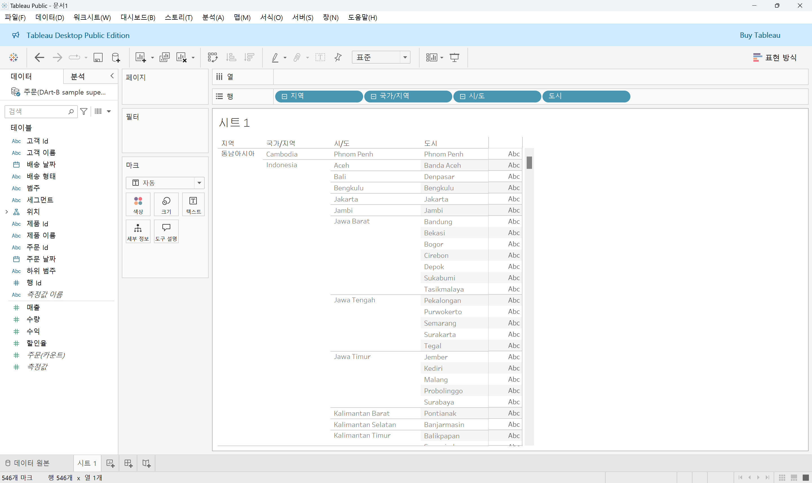
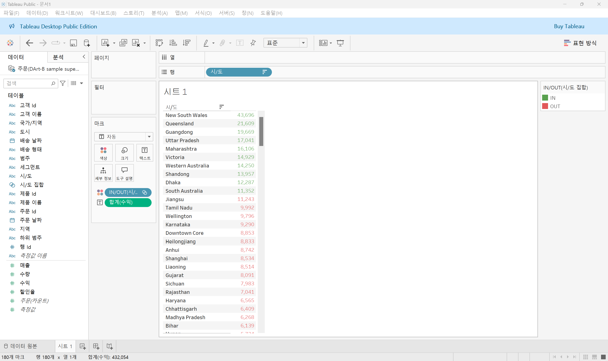

# Fourth Study Week

- 30강: [계층](#30-계층)

- 31강: [집합](#31-집합)

- 32강: [결합집합](#32-결합집합)

- 33강: [계산된 필드](#33-계산된-필드)

- 34강: [행수준계산](#34-행수준계산)

- 35강: [집계계산](#35-집계계산)

- 36강: [테이블계산](#36-테이블계산)

- 37강: [퀵테이블계산(1)](#37-퀵테이블계산1)

- 38강: [퀵테이블계산(2)](#38-퀵테이블계산2)

- [문제1](#문제-1)

- [문제2](#문제-2)

- [문제3](#문제-3)

## Study Schedule

| 강의 범위     | 강의 이수 여부 | 링크                                                                                                        |
|--------------|---------|-----------------------------------------------------------------------------------------------------------|
| 1~9강        |  ✅      | [링크](https://www.youtube.com/watch?v=AXkaUrJs-Ko&list=PL87tgIIryGsa5vdz6MsaOEF8PK-YqK3fz&index=84)       |
| 10~19강      | ✅      | [링크](https://www.youtube.com/watch?v=AXkaUrJs-Ko&list=PL87tgIIryGsa5vdz6MsaOEF8PK-YqK3fz&index=75)       |
| 20~29강      | ✅      | [링크](https://www.youtube.com/watch?v=AXkaUrJs-Ko&list=PL87tgIIryGsa5vdz6MsaOEF8PK-YqK3fz&index=65)       |
| 30~38강      | ✅      | [링크](https://youtu.be/e6J0Ljd6h44?si=nhGbB7GsdOCqj15f)       |
| 39~49강      | 🍽️      | [링크](https://www.youtube.com/watch?v=AXkaUrJs-Ko&list=PL87tgIIryGsa5vdz6MsaOEF8PK-YqK3fz&index=45)       |
| 50~59강      | 🍽️      | [링크](https://www.youtube.com/watch?v=AXkaUrJs-Ko&list=PL87tgIIryGsa5vdz6MsaOEF8PK-YqK3fz&index=35)       |
| 60~69강      | 🍽️      | [링크](https://www.youtube.com/watch?v=AXkaUrJs-Ko&list=PL87tgIIryGsa5vdz6MsaOEF8PK-YqK3fz&index=25)       |
| 70~79강      | 🍽️      | [링크](https://www.youtube.com/watch?v=AXkaUrJs-Ko&list=PL87tgIIryGsa5vdz6MsaOEF8PK-YqK3fz&index=15)       |
| 80~89강      | 🍽️      | [링크](https://www.youtube.com/watch?v=AXkaUrJs-Ko&list=PL87tgIIryGsa5vdz6MsaOEF8PK-YqK3fz&index=5)        |

<!-- 여기까진 그대로 둬 주세요-->

> **🧞‍♀️ 오늘의 스터디는 지니와 함께합니다.**

## 30. 계층

<!-- 계층 구조와 관련된 개념, 사용 방법 등을 적어주세요. -->
```
계층은 뷰에서 데이터를 'Drill Down'하여 세부적인 값을 찾을 때 유용한 방법이다.

예를 들어, 날짜 필드를 행 선반에 올린 후 필드 왼쪽의 기호를 클릭하면 분기, 월, 일별로 매출 데이터를 확인할 수 있다.
-> Tableau에서는 날짜 데이터와 함께 제공되는 경우 자동으로 계층이 생성된다.

계층을 만들려면, 두 필드를 선택한 후 마우스 오른쪽 버튼을 클릭하고 계층 > 계층 만들기를 선택한다. 그러면 계층 만들기 창이 나타나는데, 여기에 계층 이름을 입력한 후, 나머지 필드를 계층으로 드래그한다. 계층으로 묶인 필드들의 순서를 정렬하려면 필드를 끌어서 원하는 순서로 배치하면 된다.
```

## 31. 집합

<!-- 집합의 정의 및 활용 방법에 대해 알게 된 점을 적어주세요. -->
```
집합은 사용자가 특정 조건을 설정하고, 그 조건을 기반으로 데이터를 구분하는 방법이다.

집합을 만들려면 필드 위에서 마우스 오른쪽 버튼을 클릭한 후, 만들기 > 집합을 선택한다. 그러면 집합 만들기 설정 화면이 나타나는데, 상단에 일반, 조건, 상위라는 3개의 탭이 있다. '일반' 탭에서는 그룹 기능과 비슷하게 데이터를 수동으로 선택하여 묶을 수 있다. '조건' 탭은 사용자가 설정한 조건을 충족하는 데이터를 자동으로 묶어준다. '상위' 탭에서는 필드 기준으로 상위 또는 하위 순서에 따라 데이터를 묶을 수 있으며, 이 과정을 통해 데이터 패널에 집합 필드가 생성된다.

집합 조건을 충족하는 데이터는 'IN', 나머지 데이터는 'OUT'으로 구분된다. 또한, 데이터가 업데이트되면 집합은 자동으로 이를 반영한다.
```

## 32. 결합집합

<!-- 결합집합의 개념 및 사용 사례를 적어주세요. -->
```
집합을 만들 때 두 가지 조건을 동시에 적용하려면 결합된 집합을 사용한다.

사용 사례: 매출 5만 원 이상 & 수익률 10% 이상
1. 먼저, 각 조건에 맞는 집합 필드를 생성한다. 데이터 원본 필드와 생성된 집합 필드를 각각 마크 창의 텍스트와 색상 영역으로 드래그한다.
2. 두 집합 필드 중 하나를 선택한 후, 마우스 오른쪽 버튼을 클릭하고 결합된 집합 만들기를 선택한다.
3. 결합된 집합 만들기 화면이 나타나면, 앞서 생성한 두 개의 집합을 선택한 후, 제공되는 네 가지 결합 방법 중에서 두 가지 조건을 모두 충족하는 데이터를 선택하는 두 번째 옵션을 선택하여 집합 필드를 결합한다.
4. 결합된 필드를 색상 영역으로 드래그하면 결과가 표시된다.
* 만약 결합 옵션을 변경하고 싶다면, 결합된 집합 필드를 우클릭한 후 집합 편집을 선택하여 수정할 수 있다.
```

## 33. 계산된 필드

<!-- 계산된 필드를 사용하는 방법과 예시를 적어주세요. -->
```
계산된 필드는 데이터 원본에 있는 필드를 활용하여 새로운 필드를 만들 때 사용되는 기능으로, 기존 데이터 외에 추가적으로 계산된 데이터가 필요할 경우에 활용한다.

계산된 필드를 만드는 방법:
- 데이터 패널을 통해 생성하는 방법
- 분석 탭을 활용해 생성하는 방법
- 사용하고자 하는 필드 위에 마우스 우클릭하여 만드는 방법

위 방법 중 하나를 사용하면 입력창이 나타나고, 상단에 계산된 필드의 이름을 입력할 수 있다. 하단 공간에는 필요한 계산식을 작성하면 되며, 입력창 오른쪽을 클릭하면 함수에 대한 정보를 확인할 수 있다. 함수를 선택하면 해당 함수의 설명과 예시도 함께 제공된다. 드롭다운 메뉴를 클릭하면 다양한 함수 목록도 볼 수 있다.

계산식을 입력하는 순간 관련 함수들이 자동으로 나열되는데, 이때 필드를 드래그 앤 드롭하거나 입력창에 필드 이름을 입력하여 선택한다. 필드 이름은 대괄호 안에 입력해야 하며, 계산 필드에 문자 값을 입력할 때는 작은따옴표 안에 넣어야 한다. 주석을 추가하려면 //을 입력한 후 작성하면 된다.

사용 사례:
1. 데이터 패널의 역삼각형을 클릭하고 계산된 필드 만들기를 선택한다.
2. 계산된 필드의 이름을 수익률(%)로 입력하고, 집계 함수인 SUM을 사용하여 전체 수익 합계를 전체 매출 합계로 나눈 계산식을 작성한다.
3. 계산식을 작성한 후 확인을 클릭하면 데이터 패널에서 새로 생성된 수익률(%) 필드를 확인할 수 있다.
4. 이 필드를 백분율로 표시하려면, 해당 필드에서 마우스 우클릭 후 기본 속성에서 숫자 형식을 백분율로 변경한다.
* 필드 옆에 표시되는 = 기호는 해당 필드가 계산된 필드임을 의미한다.
```

## 34. 행수준계산

<!-- 행수준 계산의 의미와 적용 방법을 적어주세요. -->
```
계산된 필드는 크게 기본 계산, 테이블 계산, LOD 표현 세 가지로 나눌 수 있다.

기본 계산
- 행 수준 계산: 데이터의 각 레코드를 기반으로 계산하는 방식이다.
- 집계 계산: 현재 뷰에서 보이는 기준으로 집계된 데이터를 기반으로 계산하는 방식이다.

사용 사례 1:
1. 데이터 패널에서 계산된 필드 만들기를 선택한다.
2. 계산된 필드 이름은 고객 이름(분리)와 고객 성(분리)으로 설정한다.
3. 이름을 분리하기 위해 SPLIT 함수를 사용한다. 고객 이름 필드를 입력하고, 구분 기호를 작은 따옴표 안에 스페이스(빈칸)로 설정한다. 이름과 성 순서에 따라 1과 2를 입력하고 확인을 클릭한다.
4. 이후, 고객 이름, 고객 이름(분리), 고객 성(분리) 필드를 행 선반으로 드래그 앤 드롭하면, 분리된 이름과 성을 확인할 수 있다.

사용 사례 2:
1. 제품 이름 필드를 행 선반에, 수익 필드를 마크 카드의 텍스트 위로 드래그 앤 드롭하여 각 제품의 수익을 확인한다.
2. 계산된 필드에서 다음과 같은 논리식을 작성한다:
    IF [수익] > 0 THEN '수익성 있음'  
    ELSEIF [수익] < 0 THEN '수익성 없음'  
    ELSE '손익 평형'  
    END  
3. 생성된 계산된 필드를 행 선반에 드래그 앤 드롭하여 각 제품의 수익성 여부를 확인한다.

사용 사례 3:
1. 주문 처리 일수라는 계산된 필드를 만들어, 주문 날짜로부터 배송 날짜까지의 일수를 계산한다.
    DATEDIFF('day', [주문 날짜], [배송 날짜])  
2. 주문 날짜와 배송 날짜 필드를 행 선반에 올린 후, 두 필드를 마우스 우클릭하여 자세히 > 사용자 지정을 선택하고, 사용자 지정 날짜 창에서 연도/월/일을 선택한다.
3. 주문 처리 일수 필드를 마크 카드의 텍스트 위로 드래그 앤 드롭하면 각 주문 ID마다 주문 처리 일수를 확인할 수 있다.
4. 주문 ID가 여러 제품 레코드를 가지고 있어, 계산된 필드에서 일수가 모두 합계될 수 있다. 이 문제를 해결하기 위해 주문 처리 일수 필드를 측정값에서 차원 값으로 변경하여 사용한다.
```

## 35. 집계계산

<!-- 집계계산의 정의 및 활용 사례에 대해 알게 된 점을 적어주세요. -->
```
집계 계산이란, 현재 뷰에서 보이는 기준으로 데이터를 계산하는 방식이다.

Tableau에서는 뷰에서 필드 레벨에 따라 해당 레벨과 관련된 레코드를 통해 계산하여 원하는 값을 반환하고, 데이터를 시각적으로 확인할 수 있다.

Tableau에 모든 측정값을 뷰로 드래그 앤 드롭하면, 자동으로 SUM 함수가 적용되어 필드를 보여준다. 그러나 필드에 마우스 우클릭하여 기본 속성에서 집계를 선택하면 원하는 집계 방식으로 변경할 수 있다.

사용 사례 1:
1. 계산된 필드 이름을 합계 매출 집계 계산으로 입력하고, 계산 공간에 SUM([매출])을 입력한다.
2. 제조업체 필드와 생성한 매출 필드를 더블 클릭하여 필드를 뷰에 추가한다. 이때 생성된 필드는 집계 표시가 자동으로 적용되어 합계로 나타난다.
3. Tableau가 기본으로 제공하는 필드는 마우스 우클릭하여 집계를 변경할 수 있지만, 사용자가 만든 필드는 우클릭해도 계산 수단 옵션이 나타나지 않는다.

사용 사례 2:
1. 계산된 필드 이름을 고유 주문건수로 입력하고, 계산 공간에 COUNTD([주문ID])를 입력한다.
2. 생성한 필드를 행 선반에, 주문 날짜 필드를 열 선반에 드래그 앤 드롭하여 각 연도별 주문건수를 확인한다.
* 마우스 우클릭 후 데이터 보기를 선택하면, 주문 탭에서 실제 주문건수가 훨씬 많고 동일한 주문 ID를 가진 여러 제품이 있음을 확인할 수 있다. 이는 집계 계산이 뷰에서 보이는 기준에 따라 이루어지기 때문이다.
```

## 36. 테이블계산

<!-- 테이블 계산의 개념 및 사용 방법을 적어주세요. -->
```
테이블 계산은 뷰에 표시된 데이터를 바탕으로 계산되는 방식이다.

사용 사례 1:
1. 주문 날짜 필드와 매출 필드를 더블 클릭하고, 주문 날짜 필드를 행 선반으로 드래그한 후, 분기와 월 필드를 표시한다.
2. 계산된 필드 만들기를 클릭하고, 드롭다운에서 테이블 계산을 선택한다.
3. 계산 공간에 RUNNING_SUM(SUM([매출]))을 입력하고, 필드 이름을 누적 매출로 지정하여 필드를 생성한다.
4. 생성된 필드를 마크 카드의 텍스트 위에 드래그하여, 뷰에서 누적된 매출을 확인할 수 있다.
* 생성된 필드 옆에 세모 표시는 테이블 계산 필드임을 의미한다.

기본적으로 Tableau에서 테이블 계산을 만들면 계산 방향이 테이블 옆으로 자동 설정된다.
계산 방향을 변경하려면:
1. 해당 필드에 마우스 우클릭 후 다음을 사용하여 계산에서 계산 방향을 선택한다.
2. 테이블 계산 필드에 마우스 우클릭하여 테이블 계산 편집을 선택하고, 나타나는 화면에서 계산 방향을 설정할 수 있다. 이때, Tableau는 계산 방향을 하이라이트하여 범위를 보여주며, 정렬 순서도 변경할 수 있다. 사용자 지정 옵션을 통해 원하는 정렬 기준을 설정할 수 있다.

사용 사례 2:
1. 주문 날짜 필드의 연도와 월을 행 선반에 드래그하고, 매출 필드를 더블 클릭한다.
2. 계산된 필드 만들기를 클릭하고, 계산 공간에 SUM([매출]) - LOOKUP(SUM([매출]), -1)을 입력한다. 이 식은 현재 달의 매출에서 전월 매출을 뺀 값을 계산한다.
3. 생성된 필드를 더블 클릭하면, 현재 달과 전월 매출의 차이를 뷰에서 확인할 수 있다.
```

## 37. 퀵테이블계산(1)

<!-- 퀵테이블 계산의 원리 및 예제에 대해 알게 된 점을 적어주세요. -->
```
퀵 테이블 계산은 가장 자주 사용되는 테이블 계산 유형을 간편하게 적용할 수 있도록 만든 기능이다. 사용하려는 필드에 마우스 우클릭 후 퀵 테이블 계산을 선택하면 관련 테이블 계산 옵션들이 나열된다.

사용 사례 1:
1. 주문 날짜 필드를 마우스 우클릭하여 열 선반에 드래그한다. 필드 놓기 창이 나타나면 연속형 분기(주문 날짜)를 더블 클릭하여 선택한다.
2. 매출 필드를 행 선반으로 드래그 앤 드롭한다.
3. 행 선반에 있는 매출 필드를 Ctrl 키를 누른 상태로 복제한다.
4. 복제한 매출 필드에 마우스 우클릭 후 퀵 테이블 계산에서 누계를 선택한다.
5. 이중 축을 적용하면, 누적 매출과 월별 매출을 동시에 확인할 수 있다.

사용 사례 2:
1. 주문 날짜 필드를 열 선반에, 범주 필드를 행 선반에, 매출 필드를 마크 카드의 텍스트 위에 드래그 앤 드롭한다.
2. 매출 필드에 마우스 우클릭하여 퀵 테이블 계산에서 차이를 선택한다.
3. 월별 수익 차이를 퍼센트로 보기 위해 주문 날짜 필드를 다시 열 선반에 드래그 앤 드롭한 후, 연속형 월(주문 날짜)를 더블 클릭하고, 수익 필드를 행 선반에 드래그한다.
4. 수익 필드의 기호를 클릭하여 퀵 테이블 계산에서 비율 차이를 선택한다.

사용 사례 3:
1. 지역 필드와 범주 필드를 행 선반에 드래그하고, 매출 필드를 더블 클릭한다.
2. 마크 선반에 있는 매출 필드의 기호를 클릭하여 퀵 테이블 계산에서 순위를 선택한다.
3. 매출 필드 옆에 있는 세모 표시를 클릭한 후, 다음을 사용하여 계산 옵션에서 패널(옆에서 아래로)를 선택하면, 지역별 제품 매출 순위를 확인할 수 있다.
4. 데이터 패널에서 매출 필드를 더블 클릭한다.
5. 측정값 선반에 있는 퀵 테이블 계산이 적용되지 않은 필드를 선택하고, 기호를 클릭하여 퀵 테이블 계산에서 구성 비율을 선택한다.
6. 다음을 사용하여 계산 옵션을 패널(아래로)로 변경하면, 해당 지역의 범주별 고정 비율 합이 100%로 표시된다.

사용 사례 4:
1. 고객 이름 필드를 행 선반에 드래그하고, 매출 필드를 더블 클릭한다.
2. 마크 선반에서 매출 필드에 마우스 우클릭하여 퀵 테이블 계산에서 백분위수를 선택한다.
3. 상단 툴바에서 내림차순 또는 오름차순을 클릭하여 데이터를 정렬한다.
```

## 38. 퀵테이블계산(2)

<!-- 이동평균, YTD 총계, 전년 대비 성장률, YTD 성장률 등 본 강의에서 알게 된 점을 적어주세요. -->
```
이동평균은 이전 값부터 현재 값까지의 평균을 계산하는 방식으로, 주식 데이터를 분석할 때 많이 활용된다.

사용 사례 1:
1. 연속형 분기(주문 날짜)와 매출 필드를 각각 열 선반과 행 선반에 드래그 앤 드롭한다.
2. 매출 필드를 Ctrl 키를 눌러 복사한 뒤, 복제된 매출 필드에 마우스 우클릭하여 퀵 테이블 계산 > 이동평균을 선택한다. 이렇게 하면 매출 합계를 기준으로 이동 평균이 적용된 값으로 라인 차트를 만들 수 있다.
3. 값들을 차트에 표시하려면, 매출 필드를 Ctrl 키를 누른 채 마크 카드의 레이블 위로 드래그한다.
4. 매출 필드에 마우스 우클릭 후 테이블 계산 편집을 선택하여 편집창을 확인하면, 이동 평균이 이전 두 분기와 현재 분기의 평균임을 확인할 수 있다.
5. 실제 매출 그래프와 이동 평균 매출 그래프를 비교하기 위해 이중 축을 적용한다.

YTD(Year to Date)는 특정 시점을 기준으로 그 연도의 시작부터 해당 시점까지의 총계를 나타내며, 연도보다 하위 레벨 필드(분기 또는 월)가 있어야 사용할 수 있다.

사용 사례 2:
1. 주문 날짜 필드를 행 선반에 드래그하여 년/월만 표시되도록 한다.
2. 매출을 더블 클릭하여 년/월별 매출 합계가 표시되도록 한다.
3. 매출 필드에 마우스 우클릭 후 퀵 테이블 계산 > YTD 총계를 선택한다.
4. 측정값의 매출 필드를 더블 클릭하여, YTD 총계가 제대로 적용되었는지 확인한다.

통합 성장률(Compound Annual Growth Rate)는 일정 기간 동안의 일정 성장률을 계산하는 방식이다.

사용 사례 3:
1. 주문 날짜 필드를 행 선반에 드래그하여 년/분기만 표시되도록 한다.
2. 매출을 더블 클릭하여 년/분기별 매출 합계가 표시되도록 한다.
3. 매출 필드에 마우스 우클릭 후 퀵 테이블 계산 > 통합 성장률을 선택한다.

전년 대비 성장률(Year Over Year Growth)은 같은 월을 기준으로 이전 연도 대비 성장률을 계산할 때 사용된다.

사용 사례 4:
1. 주문 날짜 필드를 행 선반에 드래그하여 년/월만 표시되도록 한다.
2. 매출을 더블 클릭하여 년/월별 매출 합계가 표시되도록 한다.
3. 매출 필드에 마우스 우클릭하여 퀵 테이블 계산 > 전년 대비 성장률을 선택한다.

YTD 성장률(Year to Date Growth)은 연도 시작부터 해당 시점까지의 성장률을 계산하는 방식이다.

사용 사례 5:
1. 주문 날짜를 행 선반에 드래그하여 년/월만 표시되도록 하고, 매출을 더블 클릭하면 각 연월 기준 매출 합계가 나온다.
2. 매출 필드에 마우스 우클릭하여 퀵 테이블 계산 > YTD 성장률을 선택한다.
3. YTD 성장률을 검증하려면, 측정값 카드에 있는 퀵 테이블 계산이 적용된 매출 필드를 더블 클릭하려 시도할 수 있다. 하지만, 이때 에러가 발생할 수 있다.
4. 측정값 카드에 있는 합계(매출)을 Ctrl 키를 누른 채 데이터 패널로 드래그하면, 임시 필드인 계산1과 계산 1 1이 생성된다.
5. 계산1 필드는 YTD 총계로, 계산 1 1 필드는 YTD 성장률로 필드명을 변경한다.
6. 생성된 YTD 총계 필드를 측정값 가운데로 넣어주면, YTD 성장률이 올바르게 계산된 것을 확인할 수 있다.
```

## 문제 1.

규석이는 이제껏 매출을 올리는 데에 힘썼었지만, 왠지 모르게 주머니에 들어오는 돈이 없어 속상합니다. 

그래서 매출이 상위 20곳에 속하지만, 수익률(%)이 마이너스인 시/도를 확인하려고 합니다.

> 수익률은 SUM([수익]) / SUM([매출])로 정의합니다.

어떤 집합을 만들었고, 어떤 결합을 하였는지를 중심으로 기술하고, 결과 자료를 첨부해주세요. 

(텍스트 표 형태이며, 색상으로 위 집합을 구분할 수 있게 만들어주세요.)

<!-- 아래 예시 이미지를 삭제하고, 직접 만든 시트 사진을 올려주세요. 시트의 이름은 본인 이름으로 기입해주세요-->



## 문제 2.
선희는 주문 Id별로 주문에서 배송까지에 걸리는 날짜 일수가 궁금했습니다. 
그래서 주문 ID별로 주문에서 배송까지 걸리는 일자를 '배송까지 걸린 일수'라는 계산된 필드로 만들고, 이를 마크에 올린 후 확인해보았습니다. 
이때, 계산된 필드의 식은 'DATEDIFF' 함수를 이용하였습니다.

배송까지 걸린 일수 계산을 위한 DATEDIFF 함수 수식을 적어주세요.

```js
DATEDIFF('day', [주문 날짜], [배송 날짜])
```


그런데 위 그림처럼 '주문 날짜'와 '배송 날짜'를 함께 행에 올려 확인해보니, 주문날짜와 배송날짜의 차이가 '배송까지 걸린 일수'와 다릅니다.

ID-2021-11126을 보니, 11월 26일 배송에 11월 30일 배송이면 4일 차이인데, 12일이 걸렸다고 하네요. 왜 이런 문제가 생긴걸까요?

```
주문 ID들이 여러 개의 제품 레코드를 가지고 있어서 계산된 필드에서 일 수를 합산했기 때문이다.
```

그리고 이를 해결하기 위해서는 어떻게 해야 할까요?

```
해당 문제를 해결하기 위해 주문 처리 일수 필드를 측정값에서 차원 값으로 변경하여 사용한다.
```



## 문제 3.

다음은 Tableau의 다양한 계산을 사용할 수 있는 경우를 빈칸으로 두고 문제를 작성한 것입니다. 각 빈칸에 적합한 계산 유형을 채워보세요.

보기
> **누계, 차이, 비율 차이, 구성 비율, 순위, 백분위수, 이동 평균, YTD 총계, 통합 성장률, 전년 대비 성장률, YTD 성장률**

| 계산 유형               | 설명                                                                 | 사용 예시                                                                                          |
|-------------------------|----------------------------------------------------------------------|-----------------------------------------------------------------------------------------------------|
| 누계           | 데이터의 누적 합계를 계산                                             | 한 기업이 월별 매출 데이터를 누적하여 연간 매출 추이를 보고 싶을 때 사용                                      |
| 차이            | 연속 데이터 포인트 간의 차이를 계산                                    | 한 기업이 월별 매출 데이터에서 전월 대비 매출 증감량을 분석하고 싶은 경우                                        |
| 비율 차이            | 연속 데이터 포인트 간의 비율 변화를 계산                               | 한 기업이 월별 매출 데이터에서 전월 대비 매출 증감률(%)을 분석하고 싶은 경우                                      |
| 구성 비율            | 전체에서 각 데이터 포인트의 비율을 계산                                | 한 기업이 전체 매출에서 각 제품군이 차지하는 비율을 보고 싶을 때 사용                                           |
| 순위            | 데이터의 순위를 매깁니다                                              | 한 기업이 제품별 매출 데이터를 순위별로 정렬하여 상위 10개 제품을 분석하고 싶은 경우                              |
| 백분위수            | 데이터의 백분위를 계산                                               | 한 기업이 고객별 구매 금액 데이터를 백분위수로 나누어 상위 25% 고객을 분석하고 싶은 경우                          |
| 이동 평균            | 일정 기간의 평균을 계산                                               | 한 기업이 주간 매출 데이터에서 4주 이동 평균을 계산하여 트렌드를 분석하고 싶은 경우                              |
| YTD 총계            | 연초부터 현재까지의 총계를 계산                                      | 한 기업이 월별 매출 데이터를 연초부터 현재까지 누적하여 연간 매출 목표 달성 여부를 분석하고 싶은 경우             |
| 통합 성장률            | 일정 기간 동안의 연평균 성장률을 계산                                  | 한 기업이 5년 간 매출 데이터를 바탕으로 연평균 성장률(CAGR)을 계산하고 싶은 경우                                  |
| 전년 대비 성장률            | 전년 동기간 대비 성장률을 계산                                        | 한 기업이 월별 매출 데이터에서 전년 동월 대비 매출 성장률을 분석하고 싶은 경우                                    |
| YTD 성장률            | 연초부터 현재까지의 성장률을 계산                                     | 한 기업이 올해 연초부터 현재까지의 매출이 전년 동기 대비 얼마나 성장했는지 분석하고 싶은 경우                     |

> 사용 예시를 참고하여 실제 경우처럼 생각하며 고민해보아요!