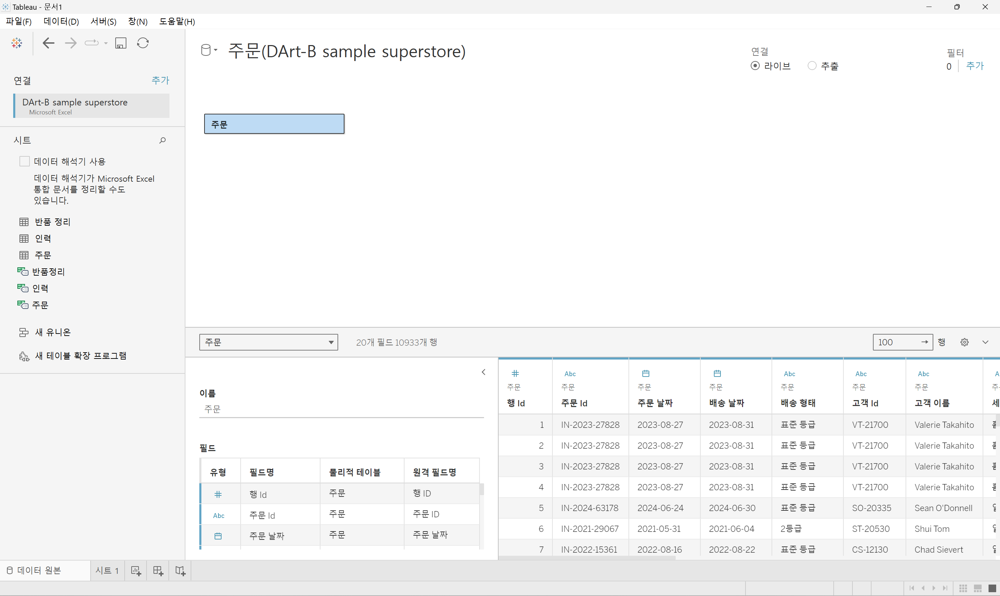

# Sixth Study Week


## Study Schedule
<br>

| 회차 | 강의 범위   | 강의 이수 여부 | 링크                                                                                                     |
|------|-------------|----------------|--------------------------------------------------------------------------------------------------------|
| 1    | 1~7강       | ✅              | [링크](https://www.youtube.com/watch?v=AXkaUrJs-Ko&list=PL87tgIIryGsa5vdz6MsaOEF8PK-YqK3fz&index=84)    |
| 2    | 8~17강      | ✅              | [링크](https://www.youtube.com/watch?v=AXkaUrJs-Ko&list=PL87tgIIryGsa5vdz6MsaOEF8PK-YqK3fz&index=75)    |
| 3    | 18~27강     | ✅              | [링크](https://www.youtube.com/watch?v=AXkaUrJs-Ko&list=PL87tgIIryGsa5vdz6MsaOEF8PK-YqK3fz&index=65)    |
| 4    | 28~37강     | ✅              | [링크](https://www.youtube.com/watch?v=e6J0Ljd6h44&list=PL87tgIIryGsa5vdz6MsaOEF8PK-YqK3fz&index=55)    |
| 5    | 38~47강     | ✅              | [링크](https://www.youtube.com/watch?v=AXkaUrJs-Ko&list=PL87tgIIryGsa5vdz6MsaOEF8PK-YqK3fz&index=45)    |
| 6    | 48~57강     | ✅              | [링크](https://www.youtube.com/watch?v=AXkaUrJs-Ko&list=PL87tgIIryGsa5vdz6MsaOEF8PK-YqK3fz&index=35)    |
| 7    | 58~67강     | 🍽️             | [링크](https://www.youtube.com/watch?v=AXkaUrJs-Ko&list=PL87tgIIryGsa5vdz6MsaOEF8PK-YqK3fz&index=25)    |
| 8    | 68~77강     | 🍽️             | [링크](https://www.youtube.com/watch?v=AXkaUrJs-Ko&list=PL87tgIIryGsa5vdz6MsaOEF8PK-YqK3fz&index=15)    |
| 9    | 78~85강     | 🍽️             | [링크](https://www.youtube.com/watch?v=AXkaUrJs-Ko&list=PL87tgIIryGsa5vdz6MsaOEF8PK-YqK3fz&index=5)     |
---

<br/>
<!-- 여기까진 그대로 둬 주세요-->

> **🧞‍♀️ 오늘은 강의보다 실습과 대시보드 직접 만들기가 더 중요하니, 기록보다는 사고하며 강의를 들어주세요.**

## 48. 워크시트 서식(2)

<!-- 워크시트에 관해 본 강의에서 알게 된 점을 적어주세요 -->
```
* 테두리 서식은 뷰에서 테이블, 패널, 셀 및 머리글을 둘러싸는 라인의 서식을 설정하고 라인 서식은 뷰에서 표시된 데이터의 축에 대한 라인의 모양을 설정할 수 있음

테두리
- 서식 > 테두리 > 테두리 유형, 두께, 색상 설정
- 행/열 구분선에서 테두리의 필드 기준을 설정할 수 있음
    - 왼쪽 눈금 => 전체 테이블 기준으로 테두리가 설정됨
    - 가운데 눈금 => 상위 필드 기준으로 테두리가 설정됨
    - 오른쪽 눈금 => 하위 필드 기준으로 테두리가 설정됨
    + 필드를 추가하면 해당 수준에 눈금이 추가됨

라인
- 서식 > 라인 > 라인 유형, 두께, 색상 설정
- 0 기준선 변경할 수 있음
- 차트에 추세선과 참조선을 추가하면 각 라인들에 서식을 별도로 설정할 수 있음
- 관련 축의 서식을 변경할 수 있음
```


## 49강. 대시보드패널

<!-- 대시보드패널 강의에서 알게 된 점을 적어주세요. -->
```
- 화면 하단에 "새 워크시트" 옆에 "새 대시보드"를 클릭

- (왼쪽) 대시보드 패널 + (오른쪽) 대시보드 디자인 페이지

- 대시보드 패널 "크기" 항목
    - 대시보드 크기를 설정할 수 있음
    - 드롭다운 메뉴로 구성되며 클릭하면 고정된 기본 크기들, 화면을 채우는 자동 크기, 크기 범위를 선택할 수 있음
        - 고정된 크기: 대시보드를 자주 표시하는 크기로 구성되어 있음

- 대시보드에서 사용할 수 있는 워크시트들을 "시트" 항목에서 확인할 수 있음
    - 해당 시트들은 현재 통합 문서에 있는 워크시트들
    - 새로운 워크시트를 만들면 "시트" 항목에 자동으로 추가됨
    - 시트를 대시보드로 드래그 앤 드롭하면 대시보드에 시트가 자동으로 채워짐
    - 다른 시트를 드래그 앤 드롭하면 하이라이트로 시트 공간 구분을 표시함
    - Tableau가 지원하는 다른 개체들을 추가할 수 있음

- Tableau 내 대시보드는 여러가지 디바이스별 해상도를 지원함
    - 기기 미리 보기 > 기기 유형 > 모델(해상도)
```


## 50. 대시보드 구성방식

<!-- 알게 된 점을 적고, 아래 질문에 답해보세요 :) -->
```
Tableau 내 대시보드에 개체를 추가하는 구성 방식

1. 바둑판식
- 격자무늬 구조에 따라 개체들을 구성할 수 있음
* 개체를 드래그 앤 드롭하면 격자무늬 구조의 특정 위치에만 추가할 수 있음
- 대시보드의 크기가 자주 변경되는 경우 👍 => 개체를 추가하면 대시보드 크기를 변경해도 개체가 유사한 형식을 유지할 수 있음

2. 부동
- 개체를 자유롭게 배치할 수 있으며 사용자가 원하는 대로 개체를 드래그 앤 드롭하여 배치할 수 있음
* 개체를 원하는 위치에 드래그 앤 드롭하면 되고, 해당 개체를 움직이더라도 다른 개체의 크기나 모양에는 영향을 주지 않음 
- 대시보드의 크기가 자주 변경되지 않는 경우 👍 => 개체를 추가하면 해당 개체의 위치 또는 형식이 다를 수도 있음 
- 그래프 내에 빈 공간이 많은 경우 👍 => 개체를 사용하여 해당 빈 공간을 채울 수 있음
```

> **🧞‍♀️ 부동과 바둑판식 방식을 차이를 중점으로 기술해보세요**
```
부동 방식은 시각화 요소를 자유롭게 배치하고 크기와 위치를 세밀하게 조정할 수 있어 복잡한 디자인에 유리하며, 바둑판식 방식은 요소들이 자동으로 정렬되는 그리드 시스템을 사용하여 깔끔하고 반응형인 대시보드를 쉽게 구성할 수 있음
```


## 51. 대시보드 컨테이너
```
- 컨테이너는 대시보드 개체들과 워크시트들을 그룹화하고 구성할 수 있는 공간

1. 가로 컨테이너
- 내부의 개체들을 수평 공간으로 배열할 때 사용

2. 세로 컨테이너
- 내부 개체들을 수직 공간으로 배열할 때 사용

- 빈 페이지 개체를 공백 채우기로 배치하면 나중에 용기 크기를 포맷하면 도움이 됨
- 컨테이너를 제대로 배치했는지 확인하기 위해 "레이아웃" 탭을 클릭하면 "항목 계층" 항목에 컨테이너가 들어가 있는지 볼 수 있음
- 컨테이너 크기를 조정하려면 배너 하나를 클릭하고 개체 잡는 부분을 더블 클릭하여 배너들을 가지고 있는 컨테이너가 선택하고, "기타 옵션"의 "높이 편집"에서 값을 조정목에 컨테이너가 들어가 있는지 볼 수 있음
- 배너 하나를 클릭하고 개체 잡는 부분을 더블 클릭하여 배너들을 가지고 있는 컨테이너가 선택하고, "기타 옵션"의 "높이 편집"에서 컨테이너 크기를 조정할 수 있음
    - "높이 편집" 옵션 드롭다운 메뉴 X => 처음에 배치한 세로 컨테이너 X or 현재 가로 컨테이너가 세로 컨테이너 내에 배치 X
```

## 52. 레이아웃 패널
```
- 레이아웃 탭에서는 대시보드의 개체 속성을 변경할 수 있음

- 그래프 중 하나를 클릭하고 "레이아웃" 탭을 클릭하면 해당 개체에 변경할 수 있는 옵션들이 나타남 
1. 제목 표시 옵션 => 그래프의 제목은 기본적으로 워크시트의 제목으로 설정되어 있음 
2. 부동 옵션 => 선택한 개체를 부동 개체로 변경하여 개체를 자유롭게 이동할 수 있음
    + 부동 옵션을 해제하면 해당 개체가 이전의 위치로 돌아가지 않음
3. "위치" & "크기" 옵션 => 개체의 위치와 크기를 픽셀 단위로 변경할 수 있음 
    + 해당 옵션들 중 부동 개체에만 변경할 수 있음
4. "테두리" 옵션 => 개체 테두리의 선 유형, 두께, 색상을 변경할 수 있음
5. "백그라운드" 옵션 => 선택하는 컨테이너의 색상을 변경할 수 있음
6. "여백" 옵션 
    => "바깥쪽 여백" 옵션 / 컨테이너의 모서리와 테두리 사이의 공간을 변경할 수 있음
    => "안쪽 여백" 옵션 / 선택된 개체 모서리와 테두리 사이의 공간을 변경할 수 있음
    + 기본적으로 모든 테두리를 동일하게 변경하도록 설정되어 있지만 각 측면을 개별적으로 변경하기를 원한다면 "모든 변이 동일" 선택 해제를 하면 됨
7. "항목 계층" 옵션 => 대시보드에 있는 컨테이너와 개체를 볼 수 있음
    + 개체를 클릭하면 대시보드에서는 선택된 개체를 확인할 수 있음
```


## 53. 필터 동작

<!-- 필터 동작에 대해 알게 된 점을 적어주세요 -->
```
대시보드에 필터를 추가하는 두 가지 방법

1. 차트를 클릭하고 드롭다운 메뉴에서 "필터" 옵션을 선택하여 대시보드에 표시하고자 하는 필터를 선택
> 대시보드에 선택한 필터가 컨테이너에 추가됨

2-1. "대시보드" 탭에 "동작"을 클릭하면 전체 통합 문서에 있는 대시보드 동작을 확인할 수 있음
> "동작 추가"를 클릭하고 6가지 동작 옵션 중 하나를 선택
> "필터 동작"을 클릭하고 화면 상단에 동작의 이름을 입력
> "원본 시트" 항목에 동작을 적용할 수 있는 워크시트를 선택할 수 있음
> "동작 실행 조건" 항목
    + "마우스 오버" / 차트의 마크 위에 마우스를 놓으면 나머지 데이터가 해당 마크의 데이터로 변경
    + "선택" / 차트의 마크를 클릭하면 나머지 데이터가 선택한 마크의 데이터로 변경
    + "메뉴" / 마크를 클릭할 때 마크의 도구 설명에 텍스트가 나타나고 옵션을 선택할 때 나머지 데이터를 변경
> "대상 시트" 항목은 동작을 실행하면 변경할 워크시트를 선택
> "선택을 해제할 경우의 결과"에 "필터링된 값 유지", "모든 값 표시", "모든 값 제외" 중 선택

2-2. 대시보드에 차트를 선택하고 "필터로 사용" 기호를 클릭
```

## 54. 대시보드 하이라이터 동작

<!-- 하이라이터에 대해 알게 된 점을 적어주세요 -->
```
- 대시보드에서 데이터를 필터링하는 대신 전체 데이터 중에서 선택한 조건을 따라 데이터를 하이라이트로 구분

- "대시보드" 탭에 "동작"을 클릭하고 동작 화면에 하이라이트 동작을 추가
- "원본 시트"를 선택하고 "동작 실행 조건"에 옵션을 선택 후 "대상 시트" 선택

- 대시보드 하이라이트 동작이 작동하려면 선택 기준으로 사용하는 필드가 변경할 그래프에 포함되어 있어야 함
    + 데이터를 범주별로 정렬되지 않도록 하기 위해서는 적어도 마크의 도구 설명에 데이터를 포함해야 함
```


## 55. 대시보드 URL

<!-- URL에 대해 알게 된 점을 적어주세요 -->
```
- 대시보드 동작을 이용해서 사용자가 대시보드와 상호 작용하면 사용자가 웹사이트로 이동할 수 있음

- 웹사이트 동작 기능을 만들기 위해서는 URL로 이동 동작을 설정해야 함
> "대시보드" 탭에 "동작"을 클릭
> 동작 화면이 나타나면 "동작 추가"에 "URL로 이동"을 선택
> "원본 시트"를 선택하고 "동작 실행 조건"(메뉴)을 선택
> "URL"에 페이지 URL 입력
    + 이때 URL이 차트에 공통으로 적용되기 때문에 "삽입"에 필드를 선택하여 입력
> URL로 이동 동작 이름은 "삽입"에 필드를 선택하여 입력

- 이미 만들었던 URL 동작 기능을 이용할 경우 자동으로 웹페이지를 대시보드 내에서 보이도록 하기 위해서는 웹페이지 개체를 대시보드에 배치하면 됨
> 웹페이지 개체를 배치
> URL 입력 팝업창이 나타나는데 입력을 하지 않고 "확인" 버튼을 클릭
> URL로 이동 동작을 설정하면 URL 대상 항목에 URL 표시하는 방법을 선택할 수 있음
> 웹페이지 개체에서 URL을 열어 보려면 "웹페이지 개체가 없는 경우 새 탭", "웹페이지 개체" 옵션을 선택
> "URL"과 "이름"에 각각 필드가 들어간 링크와 이름을 입력
```


## 56. 대시보드 시트에 이동 동작

<!-- 대시보드 시트에 이동에 대해 알게 된 점을 적어주세요!-->
```
- 경우에 따라 대시보드 하나만으로는 필요한 모든 데이터를 표시하기에 부족할 수 있음

기존 대시보드에서 새 대시보드로 이동 동작 설정
> 추가하고자 하는 차트에 대한 새 대시보드 생성
> 기존 대시보드에서 "대시보드" 탭에 "동작"을 클릭하고 "동작 추가" 항목에서 "시트로 이동" 동작을 선택
> "이름", "원본 시트", "동작 실행 조건"(메뉴), "대상 시트"를 선택

새 대시보드에 대한 필터 생성
> "대시보드" 탭에 "동작"을 클릭하고 "필터"를 선택
> "이름", "원본 시트", "동작 실행 조건"(선택), "대상 시트", "선택을 해제할 경우의 결과"(모든 값 표시)를 선택

기존 대시보드로 돌아가는 단추 생성
> 새 대시보드 상단에 탐색 개체를 배치하고 개체 옵션에 "편집 단추"를 선택
> "이동할 위치"에 기존 대시보드를 선택하고 단추 이름을 "기존 대시보드로 돌아가기"를 입력
> 단추 색상을 기존 대시보드의 색상과 일치하도록 변경
> 대시보드 하단의 빈 페이지를 사용하여 단추 아래에 라인을 만듬
> ALT 키를 누른 상태에서 단추를 클릭하면 기존 대시보드로 이동
```


## 57. 매개변수 변경 동작

<!-- 매개변수 변경 동작에 대해 알게 된 점을 적어주세요!-->
```
> "대시보드" 탭에서 "동작"을 선택
> "동작 추가"에 "매개 변수 변경"을 클릭
> "이름" 입력 후 "원본 시트"(라인 차트)와 "동작 실행 조건"(메뉴)을 선택
> "대상 매개 변수"를 선택하고 "원본 필드"와 "선택을 해제할 경우의 결과"(다음 값으로 설정)를 입력
> 매개 변수들의 값이 변경돼서 사용했던 필터에서 값이 변경됨
> 원래 데이터로 돌아가려면 차트에서 선택을 해제하면 됨
```


## 문제

오늘은 별도의 문제가 없습니다. 


여러 대시보드를 참고하시어, superstore 데이터를 사용해 나만의 대시보드를 제작해주세요.

**단, 워크시트 3개 이상의 그래프를 표시해야 하며 각 시트 간 상호작용성 필터 or 하이라이트 동작은 꼭 추가되어야 합니다**

어떤 부분에 가중을 두었는지, 어떤 사용자 편의성을 고려하였는지에 대한 설명이 필요합니다.


```

```