# 7th Study Week

## Study Schedule
<br>

| 회차 | 강의 범위   | 강의 이수 여부 | 링크                                                                                                     |
|------|-------------|----------------|--------------------------------------------------------------------------------------------------------|
| 1    | 1~7강       | ✅              | [링크](https://www.youtube.com/watch?v=AXkaUrJs-Ko&list=PL87tgIIryGsa5vdz6MsaOEF8PK-YqK3fz&index=84)    |
| 2    | 8~17강      | ✅              | [링크](https://www.youtube.com/watch?v=AXkaUrJs-Ko&list=PL87tgIIryGsa5vdz6MsaOEF8PK-YqK3fz&index=75)    |
| 3    | 18~27강     | ✅              | [링크](https://www.youtube.com/watch?v=AXkaUrJs-Ko&list=PL87tgIIryGsa5vdz6MsaOEF8PK-YqK3fz&index=65)    |
| 4    | 28~37강     | ✅              | [링크](https://www.youtube.com/watch?v=e6J0Ljd6h44&list=PL87tgIIryGsa5vdz6MsaOEF8PK-YqK3fz&index=55)    |
| 5    | 38~47강     | ✅              | [링크](https://www.youtube.com/watch?v=AXkaUrJs-Ko&list=PL87tgIIryGsa5vdz6MsaOEF8PK-YqK3fz&index=45)    |
| 6    | 48~57강     | ✅              | [링크](https://www.youtube.com/watch?v=AXkaUrJs-Ko&list=PL87tgIIryGsa5vdz6MsaOEF8PK-YqK3fz&index=35)    |
| 7    | 58~66강     | ✅             | [링크](https://www.youtube.com/watch?v=AXkaUrJs-Ko&list=PL87tgIIryGsa5vdz6MsaOEF8PK-YqK3fz&index=25)    |
| 8    | 67~77강     | 🍽️             | [링크](https://www.youtube.com/watch?v=AXkaUrJs-Ko&list=PL87tgIIryGsa5vdz6MsaOEF8PK-YqK3fz&index=15)    |
| 9    | 78~85강     | 🍽️             | [링크](https://www.youtube.com/watch?v=AXkaUrJs-Ko&list=PL87tgIIryGsa5vdz6MsaOEF8PK-YqK3fz&index=5)     |
---

<br/>

> **🧞‍♀️ 오늘은 강의보다 실습과 대시보드 직접 만들기가 더 중요하니, 기록보다는 사고하며 강의를 들어주세요.**
> **직접 실습파일을 다운로드하는 번거로움이 있어 assignment > 7th_files에 실습파일을 올려두었습니다. 활용해주세요!**


## 58. 집합값 변경

<!-- 집합값 변경 강의에서 알게 된 점을 적어주세요 -->
```
집합값 변경 - 대시보드에서 사용자가 특정 요소를 선택할 때, 그 요소가 집합에 포함될지 여부를 동적으로 제어할 수 있게 해 주는 기능

"대시보드"에 "동작"을 클릭하고, "동작 추가"에 "집합 값 변경"을 선택 
```
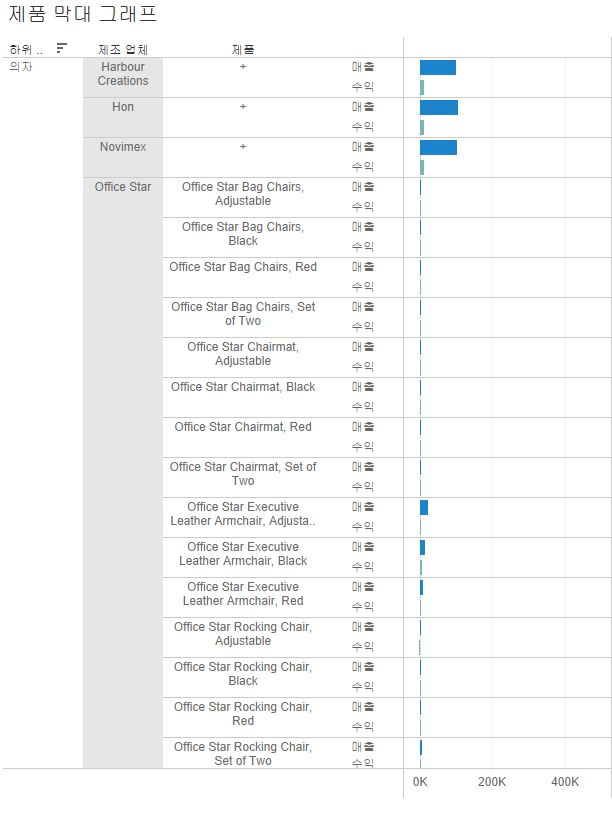
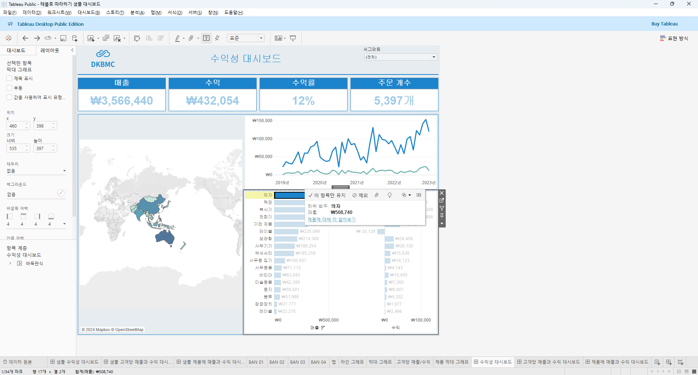
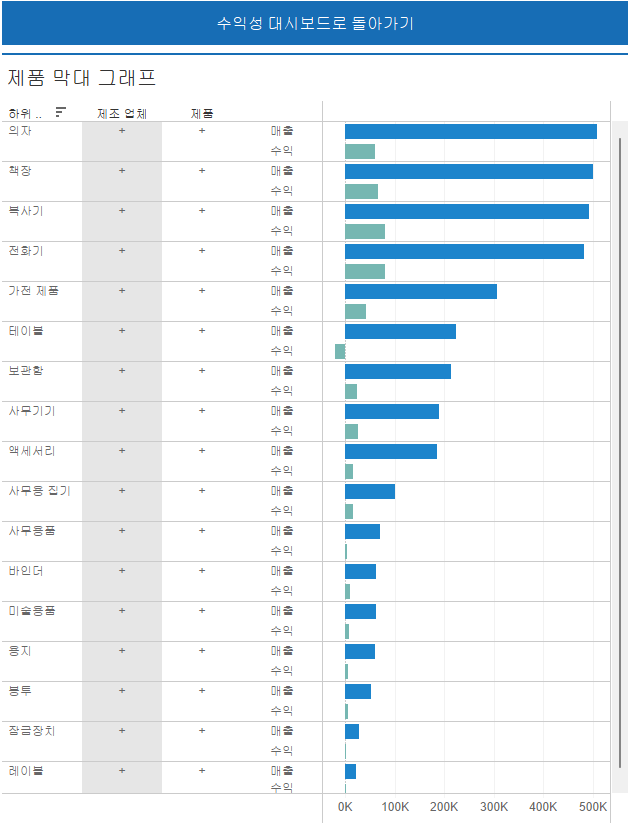


## 59강. 스토리패널

<!-- 스토리패널 강의에서 알게 된 점을 적어주세요 -->
```
스토리 - 워크시트와 대시보드에 설명을 덧붙여 스토리텔링 기능을 구현할 수 있음

- 화면 하단 "새 대시보드" 옆에 책 모양 아이콘을 한 "새 스토리"를 클릭하면 스토리를 생성할 수 있음

- 왼쪽의 스토리 패널과 오른쪽의 스토리 워크시트 페이지로 구성됨
-> 스토리 워크시트 페이지는 각 시트를 추가함으로써 스토리 포인트를 생성할 수 있는 공간
--> 스토리 각각의 개별 시트를 스토리 포인트라고 함
--> 새 스토리 포인트는 새 스토리 포인트를 추가하기 위한 옵션으로 [빈 페이지]를 선택하여 새 스토리 포인트를 추가하거나 [복제]를 선택하여 현재 스토리 포인트를 다음 스토리 포인트의 시작점으로 사용할 수 있음
-> 스토리 패널은 대시보드, 시트 및 텍스트 설명을 스토리 시트를 가져올 수 있음
--> 스토리의 크기를 설정하고 제목을 표시하거나 숨길 수 있음
--> "크기" 항목은 스토리 패널 하단에 위치해 있으며 대시보드와 같이 스토리의 크기를 설정할 수 있음

- 상단의 스토리 메뉴는 태블로 데스크탑에서만 이용 가능하며 스토리의 서식을 지정하거나 현재 스토리 포인트를 이미지 복사 및 내보내기가 가능하고 전체 스토리를 지우거나 탐색기 및 스토리 제목 표시/숨기기 등이 가능함

- 스토리 툴바는 탐색기 영역을 마우스 오버할 때 나타나며 변경된 내용을 되돌리기, 스토리 포인트에 대한 업데이트 적용, 삭제 그리고 생성이 가능함
- 스토리 포인트에서 시트 혹은 대시보드의 동작 등의 작업을 실시하고 난 뒤 스토리 툴바의 "새 이름으로 저장" 기능을 통해 현재까지 작업을 시작 지점으로 지정하여 작업을 진행할 수 있음

- 탐색기는 스토리 포인트를 편집하고 구성할 수 있으며 사용자가 탐색기를 이용해서 스토리 단계 이동이 가능함
- 탐색기 스타일은 레이아웃 패널에서 변경 가능함
```
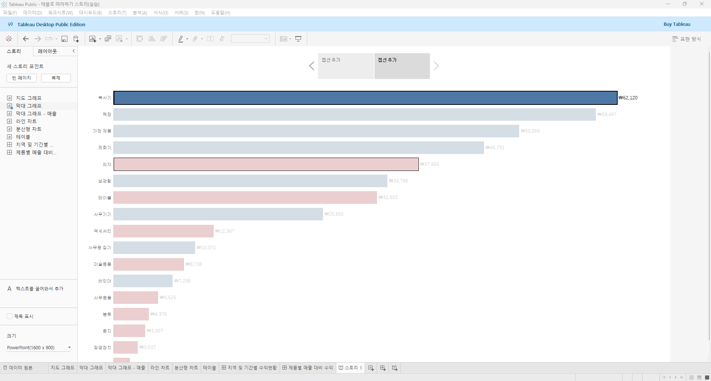


## 60. 스토리

<!-- 알게 된 점을 적고, 아래 질문에 답해보세요 :) -->
```
스토리 - 생성한 워크시트와 대시보드에 설명을 덧붙여 데이터를 설명하거나 정보를 전달하고 의사결정에 도움을 주고 설득력 있는 사례를 구성하는 등의 기능을 구현하는 작업이 가능함
```
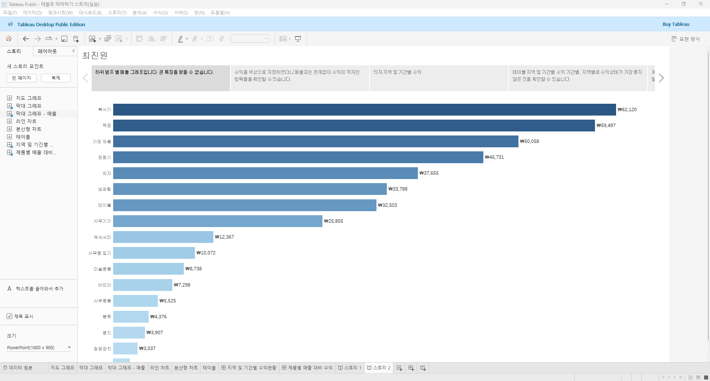
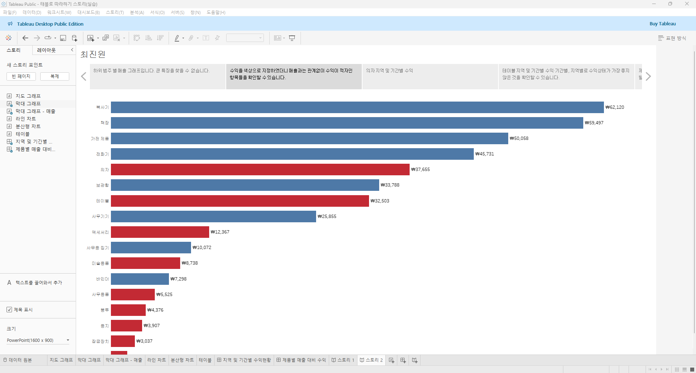
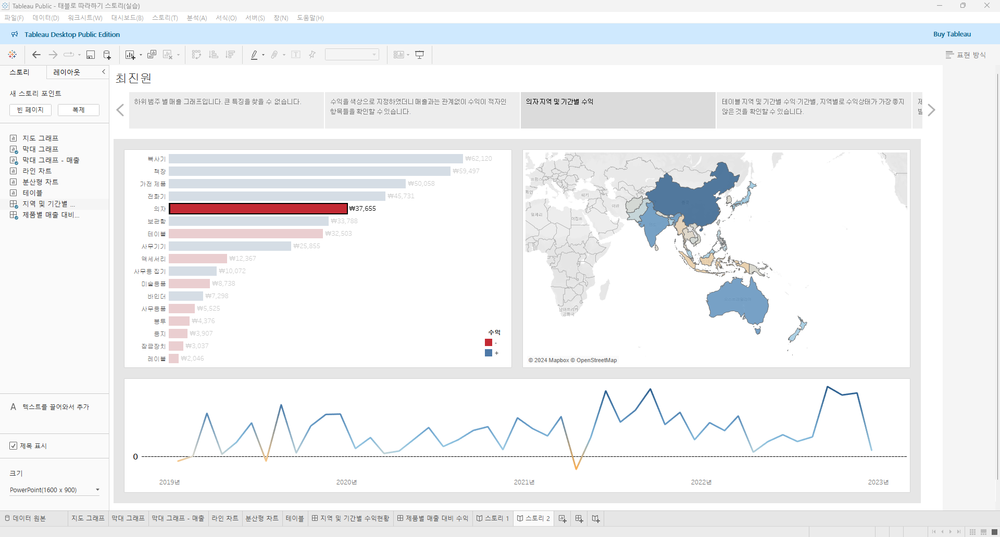
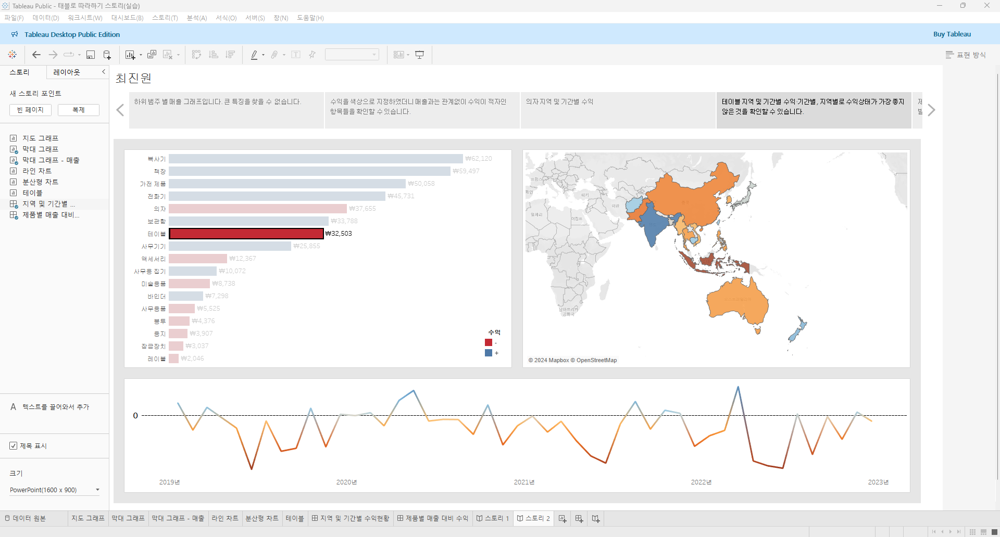
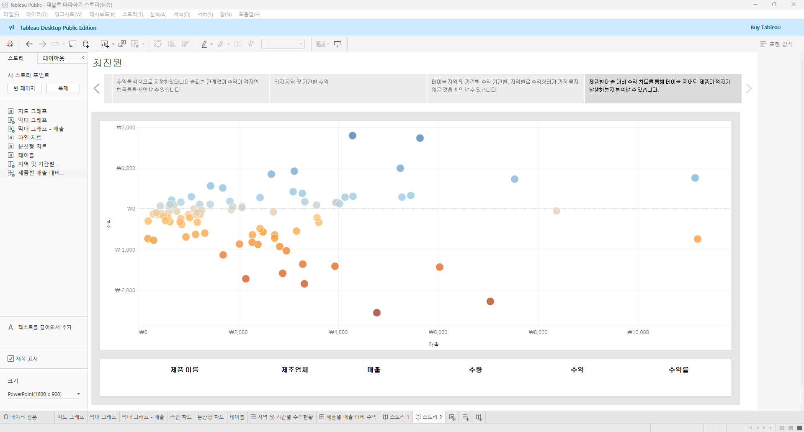


## 61. 대시보드 탐색

<!-- 대시보드 탐색 강의에서 알게 된 점을 적어주세요 -->
```
탐색 개체를 사용해서 대시보드 간 이동을 구현
```
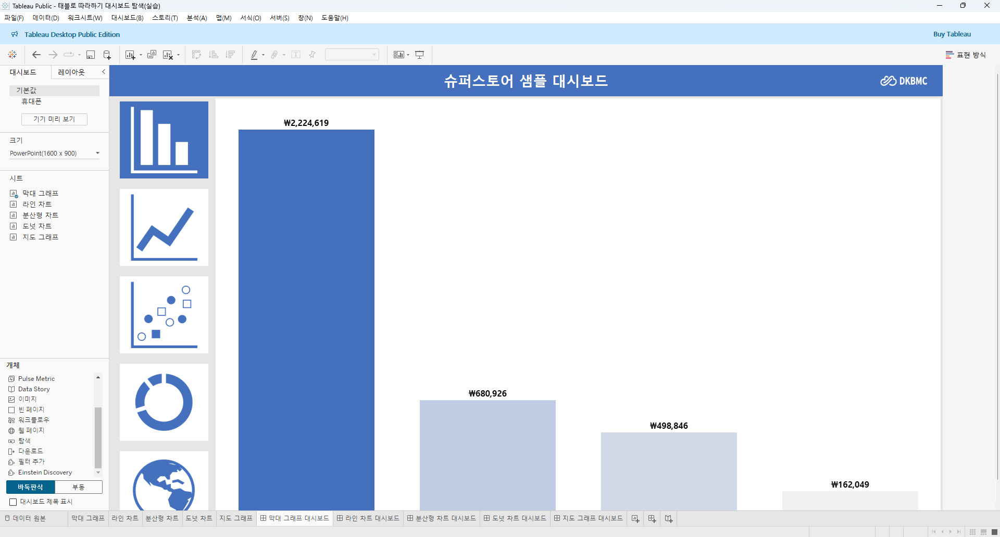
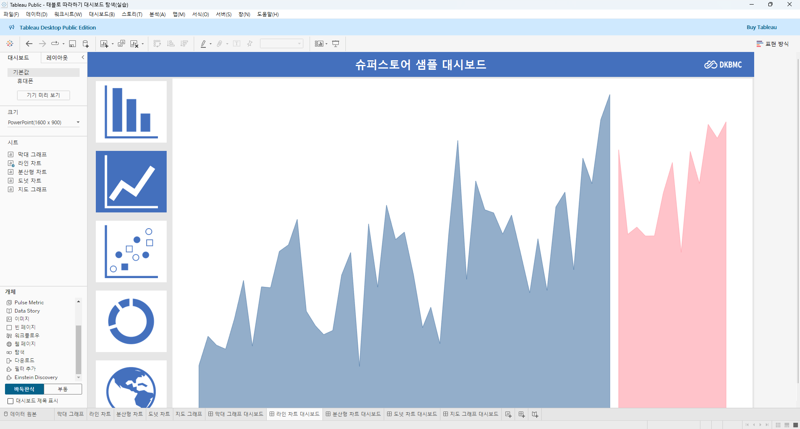
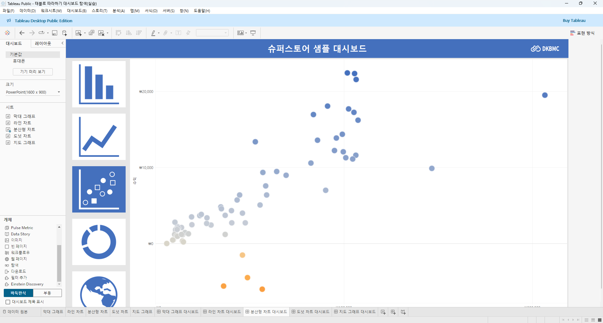
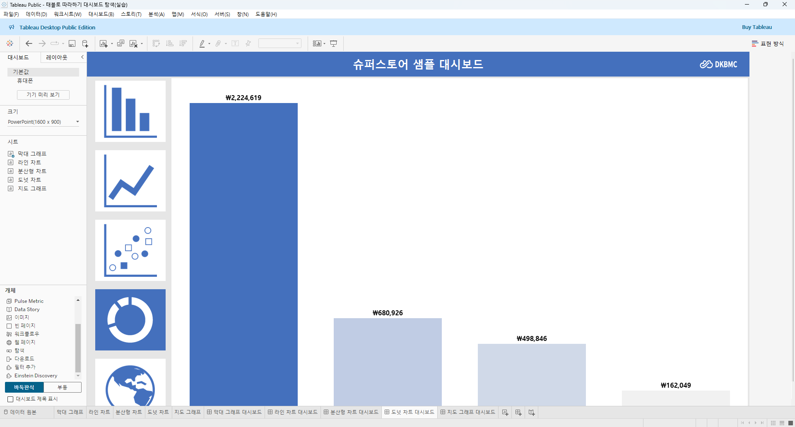
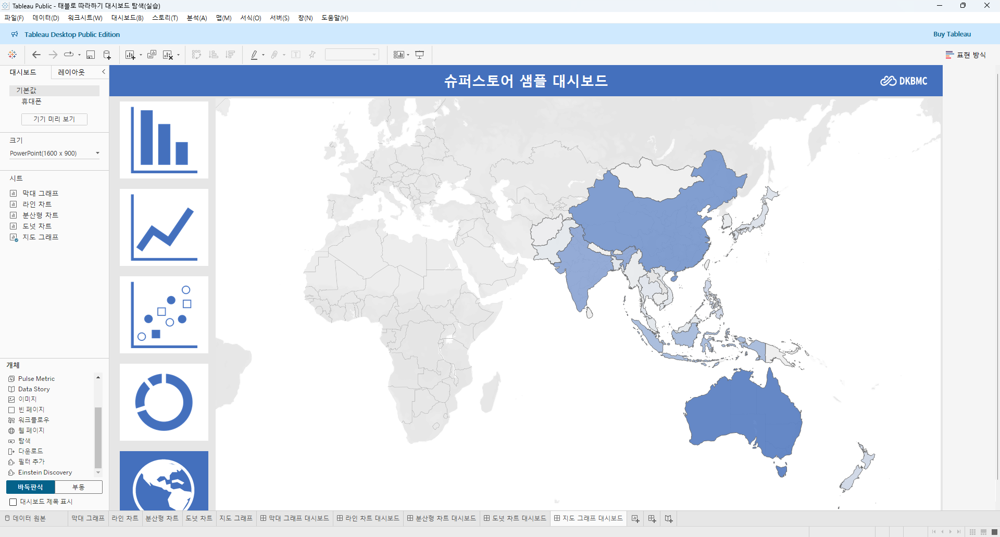


## 62. 태블로 단추

<!-- 태블로 단추 강의에서 알게 된 점을 적어주세요 -->
```
> 그래프를 선택하고 기타 옵션을 클릭한 뒤 [표시/숨기기 단추 추가]를 선택
> 부동의 형태로 X자 표시의 단추가 생성
> ALT를 누른 상태로 단추를 클릭하면 형태가 가로 세 줄 형태로 바뀌면서 그래프가 사라지는 것을 확인할 수 있음
```
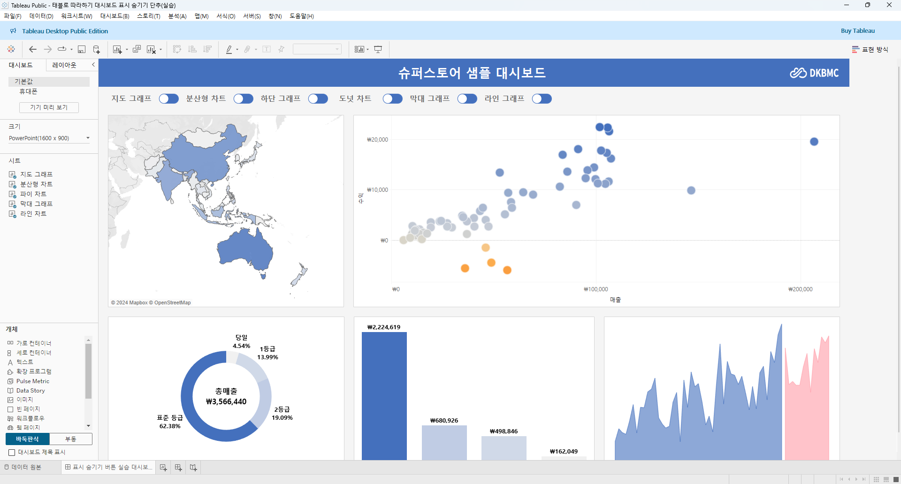
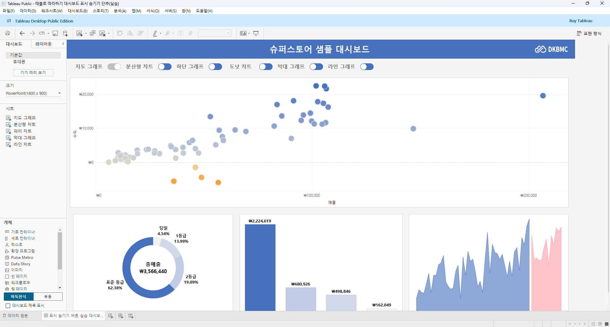
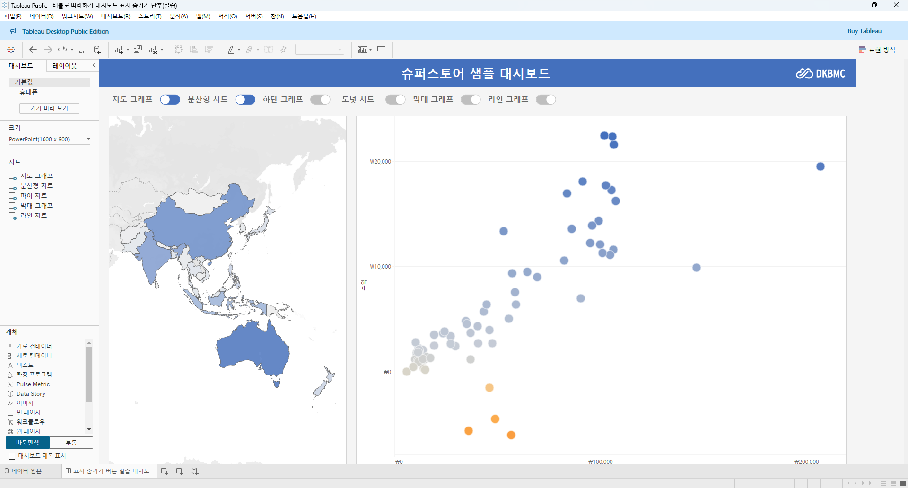


## 63. 막대그래프 드릴다운

<!-- 막대그래프 드릴다운에 대해 알게 된 점을 적어주세요 -->
```
> 드릴 다운을 구현하기 위한 매개변수를 생성
> 매개변수를 생성한 뒤 계산된 필드를 생성
> 상단 메뉴에서 [워크시트] - [동작]을 선택
> [동작] 창에서 좌측 하단에 있는 [동작 추가]를 클릭하여 [매개 변수 변경]을 클릭
> [동작 실행 조건]은 [선택], [대상 매개변수] 및 [원본 필드] 선택, [선택을 해제할 경우의 결과]는 [다음 값으로 설정]을 선택한 후 공백으로 두고 [확인]을 선택
> 한 번 더 [확인]을 눌러주고, [드릴다운] 필드를 [행] 선반에 추가
> 막대 그래프를 더블 클릭하면 드릴다운 되는 것을 확인할 수 있음
> 상단 [행] 선반의 [드릴다운] 필드를 우클릭하여 [정렬]을 선택
> [정렬 기준]을 [필드], [정렬 순서]를 [내림차순], [필드명]을 선택하고 [정렬] 창을 닫음
> 다시 한 번 막대를 클릭하여 드릴다운 해보면 하위 레벨도 정렬이 된 것을 확인할 수 있음

> 막대 그래프의 레이블이 중복되는 것을 방지하기 위해서 [드릴다운 1]에 대한 레이블 필드 추가
> 좌측 사이드 바에서 [드릴다운 1]을 [복제]하여 ELSE 구문 뒤에 오는 필드를 ""를 입력한 빈 필드를 변경하고 필드명을 "드릴다운 1 레이블"로 수정
> 수정한 필드를 [행] 선반의 [드릴다운 1]과 [드릴다운 2] 사이에 추가
> 그래프에서 [드릴다운 1]의 [머리글 표시]를 해제
> 그래프 상단의 [필드 레이블]을 우클릭하여 [행에 대한 필드 레이블 숨기기]를 체크
```
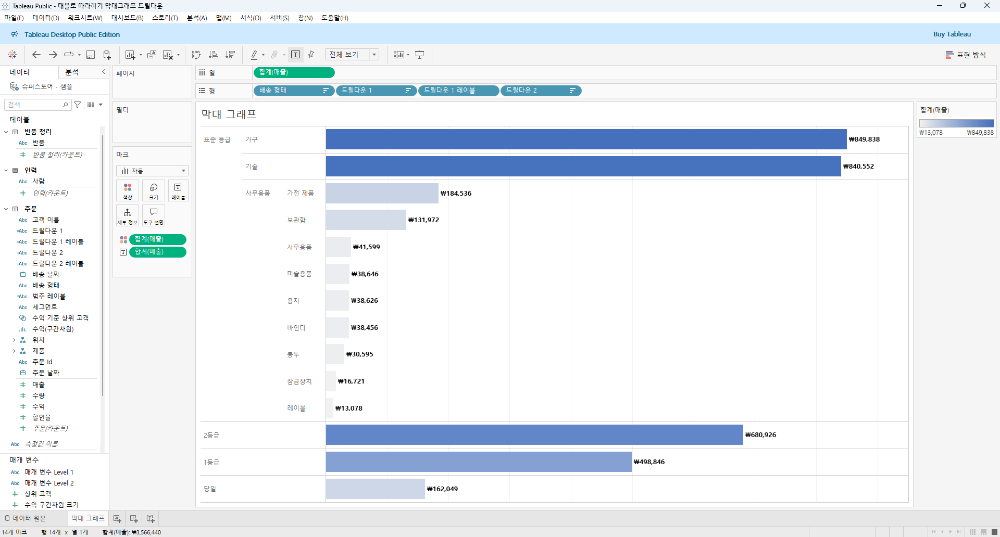


## 64. 트리맵 드릴다운

<!-- 트리맵 드릴다운에 대해 알게 된 점을 적어주세요 -->
```
> 좌측 사이드 바에서 필드를 우클릭하여 [만들기] - [집합]을 선택
> [이름]은 그대로 두고 [확인]을 클릭
> IF문을 이용하여 드릴다운 함수 생성
> 상단 메뉴에서 [워크시트] - [동작]을 선택
> [동작] 창에서 좌측 하단에 있는 [동작 추가]를 클릭하여 [집합 값 변경]을 클릭
> [동작 실행 조건]은 [선택], [대상 집합] 선택, [동작 실행 결과] [집합에 값 할당], [선택을 해제할 경우의 결과]는 [집합에서 모든 값 제거]를 선택한 후 [확인]을 선택
> 한 번 더 [확인]을 눌러주고, [드릴다운] 필드를 [마크] 선반의 [레이블] 마크에 추가
> [드릴다운] 필드를 가장 아래쪽에 위치시켜 주면 드릴다운 되는 것은 확인할 수 있음

> 트리맵의 레이블이 중복되는 것을 방지하기 위해서 [드릴다운 1]에 대한 레이블 필드 추가
> 좌측 사이드 바에서 [드릴다운 1]을 [복제]하여 ELSE 구문 뒤에 오는 필드를 ""를 입력한 빈 필드를 변경하고 필드명을 "드릴다운 1 레이블"로 수정
> [드릴다운 1 레이블] 필드를 [마크] 선반의 [레이블] 마크에 추가
> [드릴다운 1] 필드를 드래그하여 [색상] 마크인 필드를 덮어줌
> [드릴다운 1 레이블] - [드릴다운 2] - [드릴다운 1] 순으로 배치
```
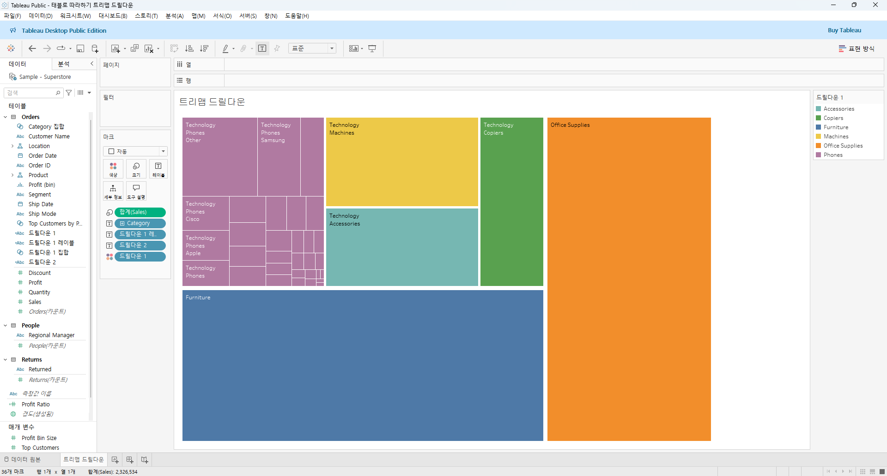


## 65. 파이 차트 드릴다운

<!-- 파일 차트 드릴다운에 대해 알게 된 점을 적어주세요 -->
```
> 좌측 사이드 바에서 필드를 우클릭하여 [만들기] - [집합]을 선택
> [이름]은 그대로 두고 [확인]을 클릭
> IF문을 이용하여 드릴다운 함수 생성
> 상단 메뉴에서 [워크시트] - [동작]을 선택
> [동작] 창에서 좌측 하단에 있는 [동작 추가]를 클릭하여 [집합 값 변경]을 클릭
> [동작 실행 조건]은 [선택], [대상 집합] 선택, [동작 실행 결과] [집합에 값 할당], [선택을 해제할 경우의 결과]는 [집합에서 모든 값 제거]를 선택한 후 [확인]을 선택
> 한 번 더 [확인]을 눌러주고, [마크] 선반에서 [크기] 마크의 필드를 제거
> [드릴다운] 필드를 [마크] 선반의 [세부 정보] 마크에 추가
> [마크] 선반의 [드릴다운] 필드 앞쪽에 [세부 정보] 아이콘을 클릭하여 유형을 [색상]으로 변경
> [마크] 선반의 필드를 우클릭하여 [정렬]을 선택
> [정렬 기준]을 [필드], [정렬 순서]를 [내림차순], [필드명]을 선택하고 [정렬] 창을 닫음
> [마크] 선반의 [드릴다운] 필드를 우클릭하여 [정렬]을 선택
> [정렬 기준]을 [필드], [정렬 순서]를 [내림차순], [필드명]을 선택하고 [정렬] 창을 닫음
> [마크] 선반의 [색상] 마크를 클릭하여 [테두리] 색상을 [흰색]으로 지정
> 상단에 [행] 선반을 더블 클릭하여 커서를 생성한 다음 "0"을 입력하여 임의의 축을 생성
> 생성한 축을 [Ctrl]을 누른 상태로 옆으로 복사하여 파이차트를 복사
> 첫 번째 축을 선택하여 [마크] 선반의 [드릴다운]을 제거하고 [크기]를 조정
> 두 번째 축도 선택하여 첫 번째 축보다 조금 적게 [크기]를 조정
> 상단의 [행] 선반 오른쪽 [0] 필드를 우클릭하여 [이중 축]을 선택
> 두 파이차트의 [크기]를 한 번 더 조정하고 우측 상단의 범례를 더블 클릭하여 [색상 편집]을 해줌
> 각각 해당하는 항목을 더블 클릭하여 [화면 색상 선택]을 통해 안쪽 색상과 맞춰줌
> 첫 번째 축을 선택하여 [마크] 선반에 있는 필드를 복사해서 [레이블] 선반에 추가

> 안쪽 레이블은 드릴다운 했을 때만 표시하기 위해서 계산된 필드를 만듬
> 좌측 사이드 바에서 [드릴다운 1]을 [복제]하여 ELSE 구문 뒤에 오는 필드를 ""를 입력한 빈 필드를 변경하고 필드명을 "드릴다운 1 레이블"로 수정
> 두 번째 축을 선택하여 [드릴다운 1 레이블] 필드를 [마크] 선반의 [레이블] 마크에 추가
> 상단의 [테두리]를 클릭하여 [행 구분선]과 [열 구분선]을 [없음] 처리하고 [라인]을 클릭하여 [격자선]과 [영(0) 기준선]도 [없음] 처리
> 축을 우클릭하여 [머리글 표시]도 [해제]
```
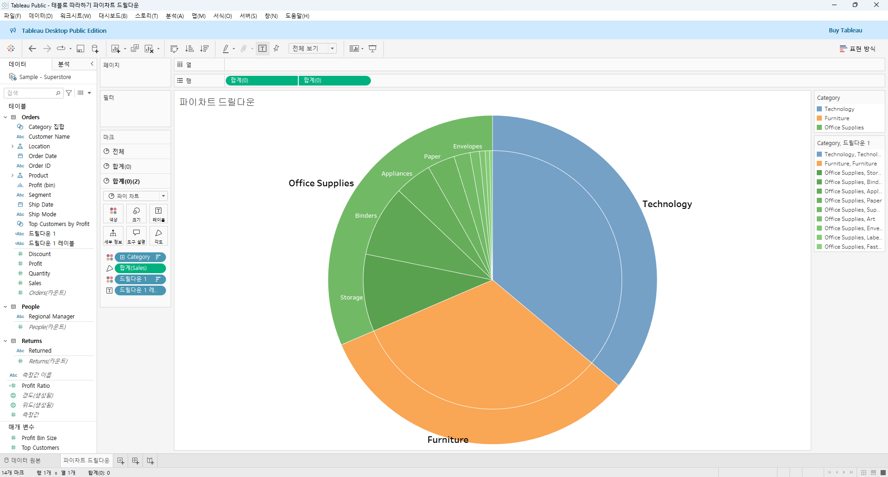


## 66. 지도 드릴다운

<!-- 지도 드릴다운에 대해 알게 된 점을 적어주세요 -->
```
> 좌측 사이드 바에서 [국가/지역] 필드를 우클릭하여 [만들기] - [집합]을 선택
> [이름]은 그대로 두고 [확인]을 클릭
> IF문을 이용하여 드릴다운 함수 생성
> 좌측 사이드 바에서 [드릴다운]의 문자열 아이콘을 클릭하여 [지리적 역할] - [만들기 원본] - [시/도]를 선택
> 상단 메뉴에서 [워크시트] - [동작]을 선택
> [동작] 창에서 좌측 하단에 있는 [동작 추가]를 클릭하여 [집합 값 변경]을 클릭
> [동작 실행 조건]은 [선택], [대상 집합] 선택, [동작 실행 결과] [집합에 값 할당], [선택을 해제할 경우의 결과]는 [집합에서 모든 값 제거]를 선택한 후 [확인]을 선택
> 한 번 더 [확인]을 눌러주고, [드릴다운] 필드를 마크 선반의 [색상] 마크에 추가
> 우측 하단에 표시된 "1개의 알 수 없는 항목"을 우클릭하여 "표시기 숨기기"를 선택

> [이름]을 "매개 변수 국가/지역"으로 놓고 [데이터 유형]은 [문자열], [허용 가능한 값]은 [목록]으로 변경
> 우측의 [다음에서 값 추가]를 클릭하여 [국가/지역]을 선택하고 맨 밑 칸의 "ALL" 값을 추가한 뒤, 목록의 맨 위로 올려줌
> IF, ELSEIF문을 사용해서 계산된 필드 [선택된 국가/지역] 생성
> [매개 변수 국가/지역]을 우클릭하여 [매개 변수 표시]를 선택하고 "ALL" 값으로 놓음
> [선택된 국가/지역] 필드를 [필터] 선반에 놓고 [참]을 선택한 후, [확인]을 클릭

> 상단 메뉴에서 [워크시트] - [동작]을 선택
> [동작] 창에서 좌측 하단에 있는 [동작 추가]를 클릭하여 [매개 변수 변경]을 클릭
> [매개 변수 변경] 창에서 [이름]을 입력하고 [동작 실행 조건]은 [선택], [대상 매개 변수]는 [매개 변수 국가/지역], [원본 필드]는 [국가/지역], [선택을 해제할 경우의 결과]는 [다음 값으로 설정]을 선택하고 "ALL"을 입력한 다음 [확인]을 선택
> 한 번 더 [확인]을 눌러주고, [도구설명] 마크를 클릭하여 설명란에 <드릴다운 1>만 남겨놓고 모두 지운 다음 [확인]을 클릭
```
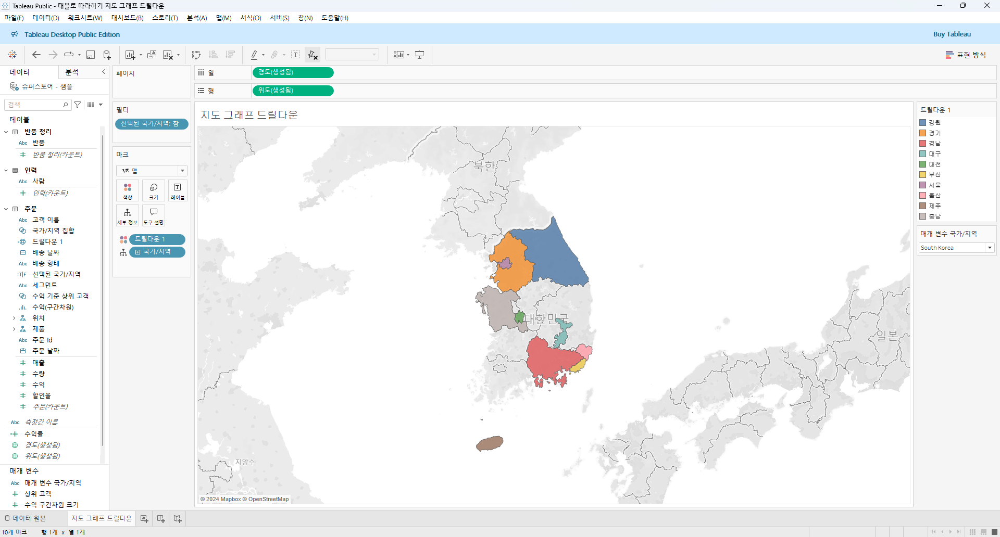


---

## 문제

오늘은 별도의 문제가 없습니다.

다만, 학술제 이후 마지막 과제(11/27~)로서 한 주 동안에는 학술제 주제 관련 데이터(없을 경우, 본인 관심 데이터)를 사용해 나만의 대시보드를 제작할 예정입니다. 또한, 학술제에서 시각화 시 태블로를 사용하기를 권장하는 안내가 나갈 예정입니다.
그 때 열심히 배운 내용을 잘 활용해주세요. 감사합니다 :)