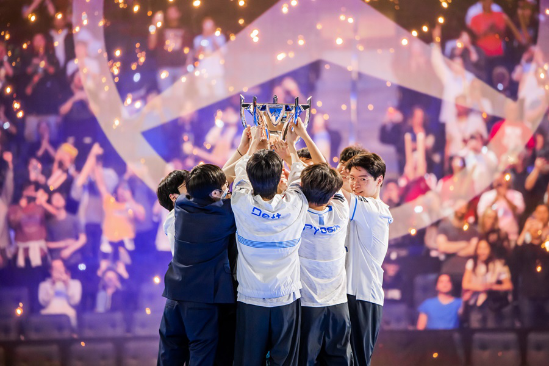
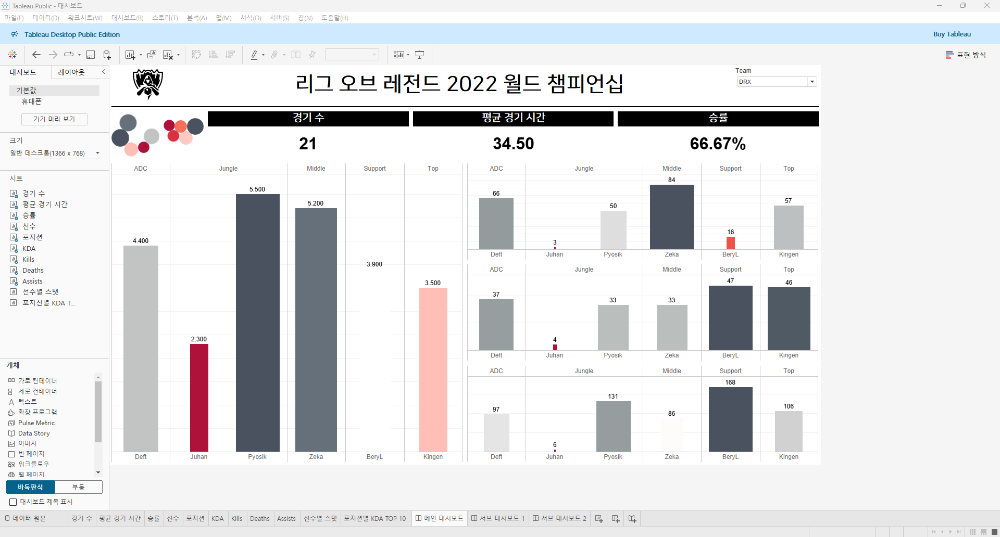
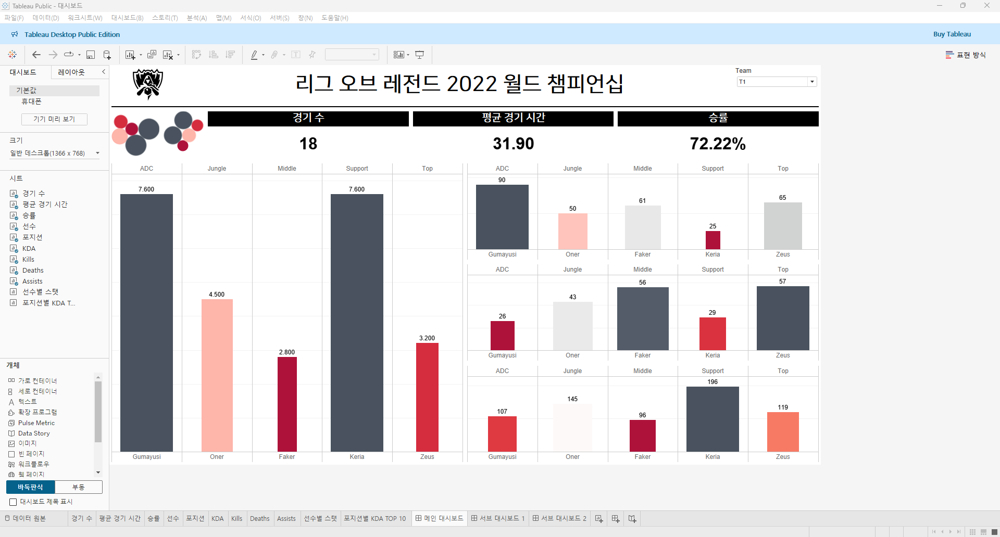
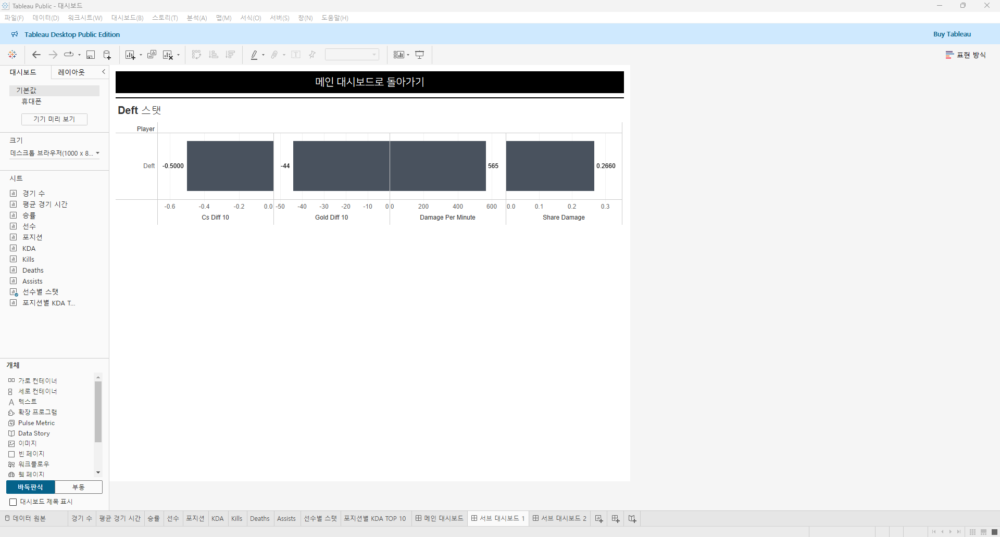
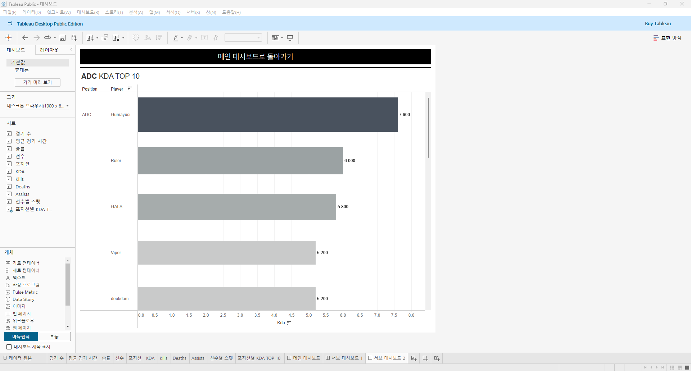

# 9th Study Week

### 사용한 데이터셋

> **리그 오브 레전드 2022 월드 챔피언십 본선 진출 팀 + 선수 지표**<br>
https://www.kaggle.com/datasets/ilyadziamidovich/league-of-legends-world-championship-2022

### 대시보드 링크
https://public.tableau.com/app/profile/.61625031/viz/2022_17331346672840/sheet11

---

### 대시보드 설명

#### 메인 대시보드 구성
- **DRX 팀 스탯**


- **T1 팀 스탯**


**메인 대시보드 표시 스탯**
- 팀 소속 선수별 KDA 비중
- 팀 소속 포지션별 KDA 비중
---
- 경기 수
- 평균 경기 시간
- 팀 소속 선수 KDA
- 팀 소속 선수 킬 수
- 팀 소속 선수 데스 수
- 팀 소속 선수 어시스트 수

```
- 메인 대시보드의 오른쪽 상단에 위치한 필터를 통해 특정 팀을 선택하면, 2022 롤드컵에서 해당 팀이 기록한 다양한 지표가 표시됨
- 해당 팀의 개략적인 지표 파악을 돕기 위해 대회에서 소화한 경기 수, 평균 경기 시간, 승률을 보여
- 리그 오브 레전드라는 게임의 가장 중요한 지표 중 하나인 KDA(데스당 킬 관여 수 | => (킬+어시스트)/데스)를 선수별 및 포지션별로 나타냈으며, 보다 세부적인 지표 관찰을 위해 킬 수, 데스 수, 어시스트 수도 함께 표시함
- 왼쪽 상단에 위치한 원 그래프는 팀 소속 선수별 및 포지션별 KDA 비중을 시각적으로 나타냄
```

---

#### 서브 대시보드 구성
- **1. 선수별 스탯**


- **2. 포지션별 KDA 상위 10명**


**서브 대시보드 표시 스탯**
- 선수별 10분 CS 차이
- 선수별 10분 골드 차이
- 선수별 분당 대미지
- 선수별 대미지 비중
---
- 포지션별 KDA TOP 10

```
- 메인 대시보드의 오른쪽 상단에 위치한 선수별 KDA 비중 원 그래프에서 특정 선수의 원을 클릭하면, 해당 선수의 대회 활약을 확인할 수 있는 다양한 지표가 표시됨
- 포지션별 KDA 비중 원 그래프에서 특정 포지션의 원을 클릭하면, 해당 포지션에서 높은 KDA를 기록한 상위 10명의 선수가 표시되며, 각 포지션의 KDA 평균치와 두각을 나타내는 선수들을 쉽게 파악할 수 있음
```
