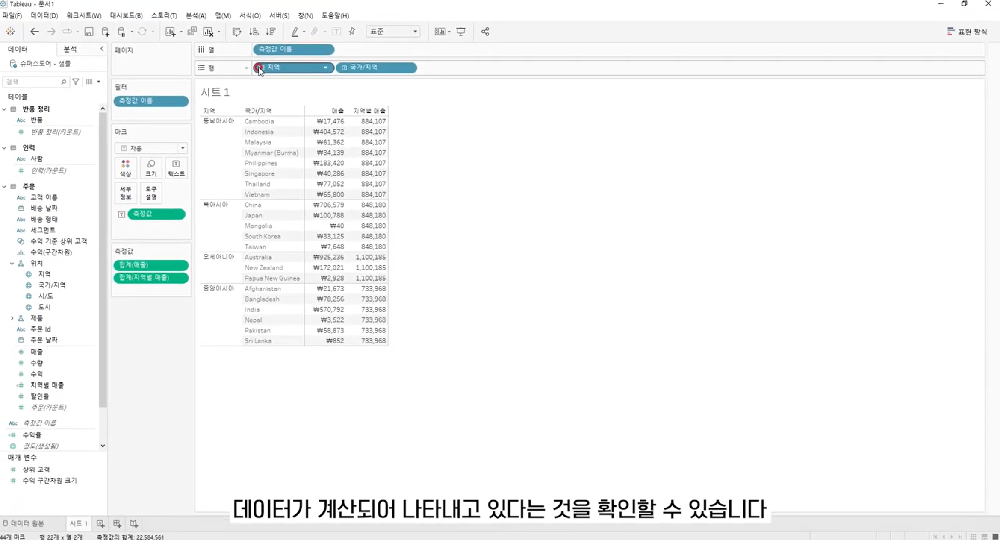
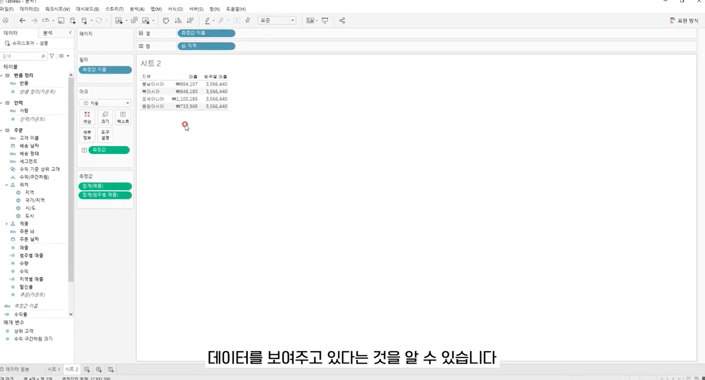
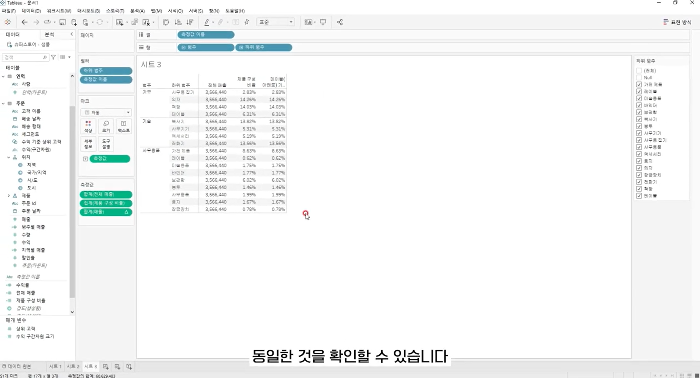
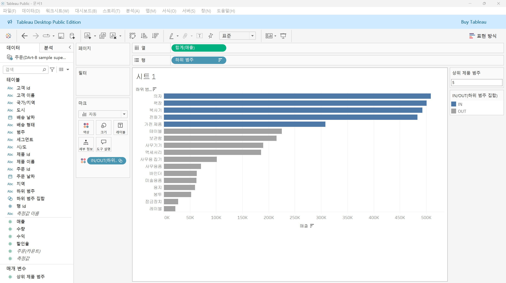
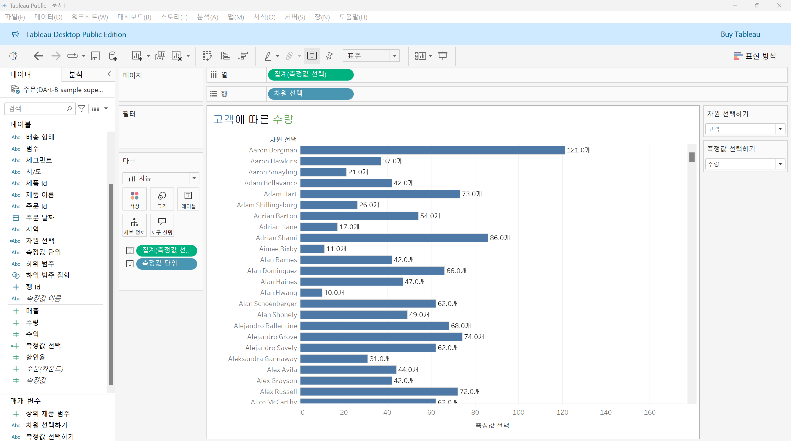
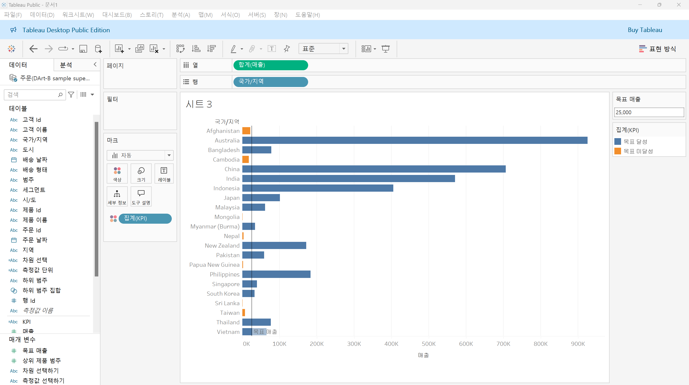
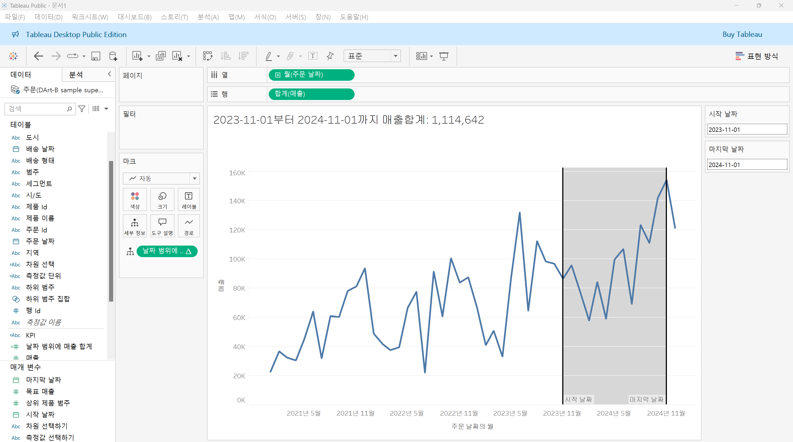
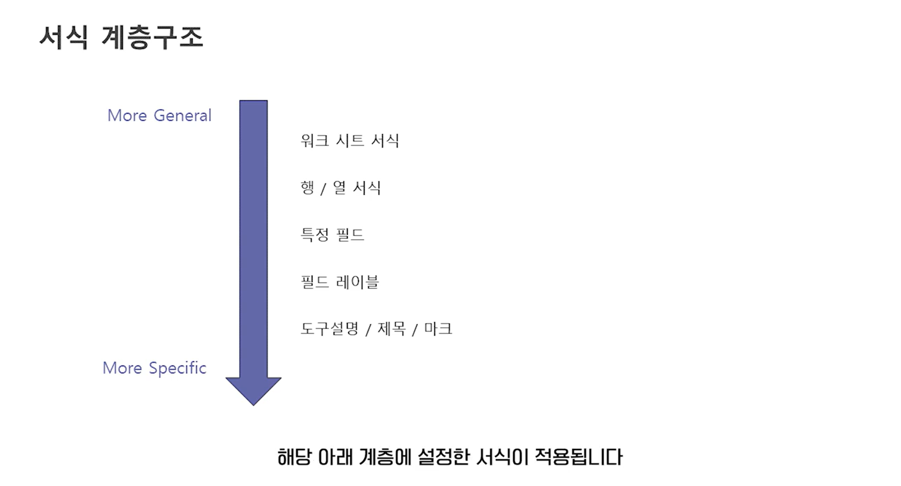
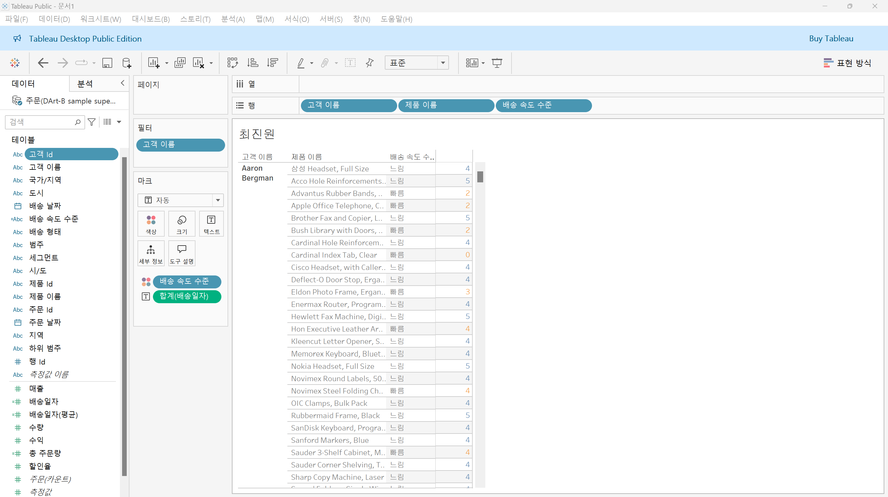
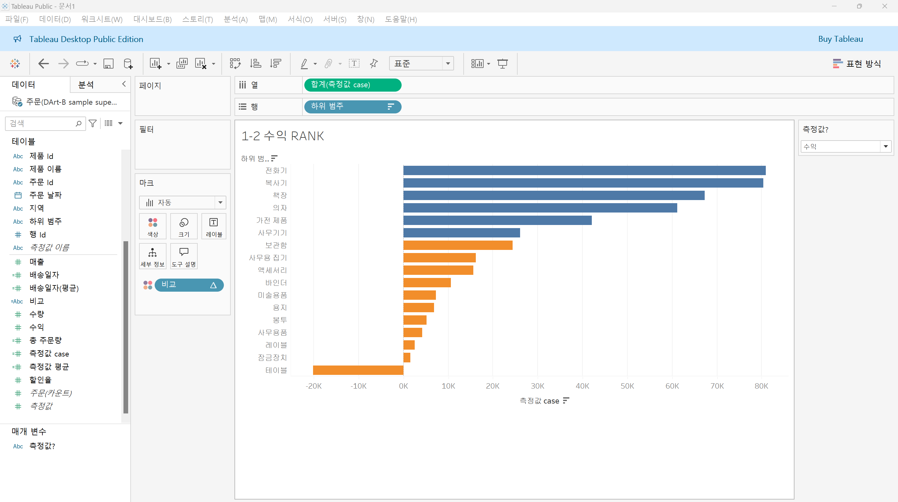

# Fifth Study Week

- 39강: [LOD](#39강-lod)

- 40강: [EXCLUDE](#40-lod-exclude)

- 41강: [INCLUDE](#41-lod-include)

- 42강 : [매개변수](#42-매개변수)

- 43강 : [매개변수 실습](#43-매개변수-실습) 


- 44강: [매개변수 실습](#44-매개변수-실습)

- 45강: [마크카드](#45-워크시트-마크카드)

- 46강: [서식계층](#46-서식-계층)

- 47강: [워크시트](#47-워크시트-서식)

- [문제1](#문제-1)

- [문제2](#문제-2)

## Study Schedule

| 강의 범위     | 강의 이수 여부 | 링크                                                                                                        |
|--------------|---------|-----------------------------------------------------------------------------------------------------------|
| 1~9강        |  ✅      | [링크](https://www.youtube.com/watch?v=AXkaUrJs-Ko&list=PL87tgIIryGsa5vdz6MsaOEF8PK-YqK3fz&index=84)       |
| 10~19강      | ✅      | [링크](https://www.youtube.com/watch?v=AXkaUrJs-Ko&list=PL87tgIIryGsa5vdz6MsaOEF8PK-YqK3fz&index=75)       |
| 20~29강      | ✅      | [링크](https://www.youtube.com/watch?v=AXkaUrJs-Ko&list=PL87tgIIryGsa5vdz6MsaOEF8PK-YqK3fz&index=65)       |
| 30~38강      | ✅      | [링크](https://www.youtube.com/watch?v=e6J0Ljd6h44&list=PL87tgIIryGsa5vdz6MsaOEF8PK-YqK3fz&index=55)       |
| 39~47강      | ✅      | [링크](https://www.youtube.com/watch?v=AXkaUrJs-Ko&list=PL87tgIIryGsa5vdz6MsaOEF8PK-YqK3fz&index=45)       |
| 48~59강      | 🍽️      | [링크](https://www.youtube.com/watch?v=AXkaUrJs-Ko&list=PL87tgIIryGsa5vdz6MsaOEF8PK-YqK3fz&index=35)       |
| 60~69강      | 🍽️      | [링크](https://www.youtube.com/watch?v=AXkaUrJs-Ko&list=PL87tgIIryGsa5vdz6MsaOEF8PK-YqK3fz&index=25)       |
| 70~79강      | 🍽️      | [링크](https://www.youtube.com/watch?v=AXkaUrJs-Ko&list=PL87tgIIryGsa5vdz6MsaOEF8PK-YqK3fz&index=15)       |
| 80~89강      | 🍽️      | [링크](https://www.youtube.com/watch?v=AXkaUrJs-Ko&list=PL87tgIIryGsa5vdz6MsaOEF8PK-YqK3fz&index=5)        |


<!-- 여기까진 그대로 둬 주세요-->

> **🧞‍♀️ 오늘의 스터디는 지니와 함께합니다.**


## 39강. LOD

<!-- INCLUDE, EXCLUDE, FIXED 등 본 강의에서 알게 된 LOD 표현식에 대해 알게 된 점을 적어주세요. -->
```
LOD(Level of Detail) - 뷰의 세부 수준을 나타냄

Tableau에서 LOD 표현식은 현재 뷰에는 영향을 받지 않고 본인이 원하는 세부 수준에서 계산을 수행할 수 있음, 즉 계산할 수준을 세부적으로 제어 가능하도록 함

FIXED LOD
-> 현재 뷰에 있는 차원과 상관없이 계산된 필드에서 원하는 차원을 따라 게산
```

**FIXED에서 설정한 차원이 뷰에 포함되어 있을 때**


**FIXED에서 설정한 차원이 뷰에 포함되어 있지 않을 때**



## 40. LOD EXCLUDE

<!-- INCLUDE, EXCLUDE, FIXED 등 본 강의에서 알게 된 LOD 표현식에 대해 알게 된 점을 적고, 아래 두 질문에 답해보세요 :) -->
```
EXCLUDE LOD는 현재 뷰에서 특정 차원을 제외하여 계산할 때 사용 
```

> **🧞‍♀️ FIXED와 EXCLUDE을 사용하는 경우의 차이가 무엇인가요?**

```
FIXED는 설정한 필드의 값만을 기준으로 집계를 고정하므로, 뷰의 다른 차원들이 영향을 주지 않는 반면, EXCLUDE는 집계에서 특정 차원을 제외하여 계산하므로, 설정된 차원 외에 뷰에 추가된 다른 차원들이 집계에 영향을 줄 수 있음
```

> **🧞‍♀️ 왜 ATTR 함수를 사용하나요?**

```
EXCLUDE를 사용하게 되면 뷰에 추가된 다른 차원들이 집계에 영향을 미쳐 특정 조건이나 상황에서 여러 값이 반환될 수 있기 때문에, 여러 값이 있을 때는 *를 반환하고, 단일 값이 있을 때는 그 값을 반환하는 ATTR 함수를 이용해 이를 방지하기 위함
```

## 41. LOD INCLUDE

<!-- INCLUDE, EXCLUDE, FIXED 등 본 강의에서 알게 된 LOD 표현식에 대해 알게 된 점을 적고, 아래 두 질문에 답해보세요 :) -->
```
INCLUDE LOD 표현식은 현재 뷰에서 특정 차원을 추가하여 계산하고, EXCLUDE LOD 표현식과 같이 차원 필터를 통해 해당 값을 변경할 수 있음 
```

> **🧞‍♀️ 그렇다면 어떤 경우에 각 표현식을 사용하나요? 예시와 함께 적어보아요**

```
FIXED: 특정 차원을 기준으로 고정된 값을 계산하며, 다른 차원의 영향을 받지 않고 차원과 측정값 모두를 반환할 수 있음 
ex) 각 지역별 총 매출을 계산할 때 FIXED [Region] : SUM([Sales])를 사용하면 뷰에 추가된 필드와 관계없이 지역별로 고정된 매출 값이 표시됨

EXCLUDE: 특정 차원을 집계에서 제외하여 계산하며, 측정값만 반환하고 차원 필터의 영향을 받음
ex) 범주별 전체 매출을 계산하면서 특정 범주를 제외하고 집계하고자 할 때 EXCLUDE [Category] : SUM([Sales])를 사용하면 Category를 제외한 상태에서 매출 합계를 계산할 수 있으며, 차원 필터에 따라 해당 값을 변경할 수 있음

INCLUDE: 계산 시 특정 차원을 추가로 포함해 계산하며, 측정값만 반환하고 차원 필터의 영향을 받음
ex) 각 고객별 평균 매출을 계산할 때, 고객별 세부 집계를 포함하고 싶다면 INCLUDE [Customer ID] : AVG([Sales])를 사용하여 Customer ID를 기준으로 고객별 평균 매출을 계산할 수 있으며, 차원 필터에 따라 해당 값을 변경할 수 있음
```

## 42. 매개변수

<!-- 매개변수에 대해 알게 된 점을 적어주세요 -->
```
- Tableau에서 매개변수는 고정된 상수 값이 아닌 동적인 값으로 변경하기 위해서 활용하는 기능
- 매개변수는 반드시 계산식, 필터, 참조선과 함께 사용

매개변수를 만드는 방법
1. 필터 - 값을 입력하는 공간에서 드롭다운 메뉴에 '새 매개변수 만들기'를 선택하면 '매개변수 만들기' 화면이 나타남
2. 필드 위에 우클릭 - 원하는 필드 위에 마우스 우클릭해 '만들기' > '매개변수'를 선택하면, 매개변수 만들기 화면이 나타남
3. 데이터 패널 - 데이터 패널의 아래 화살표를 클릭하여 '매개변수 만들기'를 선택하면 '매개변수 만들기' 화면이 나타남
```

> **🧞‍♀️ 집합에도 매개변수를 적용할 수 있나요? 시도해봅시다**


```
‘상위’ 탭에서 ‘필드 기준’을 매개변수로 설정하여 만든 집합 필드를 마크 카드의 색상으로 드래그 앤 드롭하면, 매개변수 값에 따라 상위 항목들이 색상으로 구분되는 것을 확인할 수 있음
```

## 43. 매개변수 실습

<!-- 영상 묶음에 포함되지 않아 찾기 어려우실까 링크를 아래에 첨부하겠습니다. 수강 후 삭제해주세요-->
**계산식을 활용한 매개변수 실습**

```
- 차원과 측정값에 대한 매개변수를 생성할 수 있음 
- 제목의 경우에도 '제목 편집' > '삽입'을 통해 선택한 매개변수에 따라 제목 변경이 되도록 설정할 수 있음 
- 텍스트 수정은 마크 카드 '레이블'을 클릭해 편집 화면에 들어가 텍스트를 변경할 수 있음
```

## 44. 매개변수 실습

<!-- 매개변수에 대해 알게 된 점을 적어주세요 -->
**매개변수를 활용한 참조선**

```
- '분석' 패널에 '참조선'을 뷰로 드래그하면 참조선 편집 화면이 나타남
- 라인의 값을 매개변수로 설정한 뒤, 매개변수에서 값을 입력하면 해당 값에 따라 참조선이 변경됨
- 이 매개변수를 사용해 생성한 계산된 필드를 마크 카드의 색상에 드래그 앤 드롭하면, 참조선을 기준으로 그래프의 색상이 구분되는 것을 확인할 수 있음
```

```
- 날짜 매개 변수를 생성하여 '분석' 패널에서 '참조 구간'을 뷰로 드래그해 테이블 열 위로 놓아준 뒤, 날짜 매개변수의 값을 변경하면 뷰에서 설정한 날짜 범위가 하이라이트 되어 표시됨
```

## 45. 워크시트 마크카드

<!-- 마크카드에 대해 알게 된 점을 적어주세요 -->
```
- Tableau는 다양한 차트를 표현함과 동시에 디자인을 직관적으로 표현하는 것이 중요함
- Tableau에 작업 영역인 워크시트에서 차트를 만들게 되면 해당 시트 안에 있는 데이터들을 '마크'라 하는데 이러한 마크의 서식을 변경하기 위해서는 '마크 카드'를 활용해야 함

1. 뷰를 기준으로 왼쪽에 마크 카드의 드롭 다운 메뉴를 보면 마크의 표현 방식을 선택할 수 있음

2. 마크 카드에서 색상을 통해 마크 색상, 투명도, 테두리를 설정할 수 있음
    + 후광 옵션의 경우에는 맵 차트에만 사용됨
    + 필드를 색상 옵션으로 드래그 앤 드롭하면 해당 필드에 따라 마크들이 색상으로 구분되는데, 이때 연속형 필드는 색상 범위 범례가 나타나고, 불연속형 필드는 항목별 범례가 나타남

3. 마크 카드 크기에 슬라이더를 움직이면 마크 크기를 조정할 수 있음

4. 마크 카드 레이블을 통해 텍스트를 수정할 수 있음
    + 레이블 편집 창에서 '미리 보기'를 클릭하면 텍스트가 원하는 형식으로 작성되어 있는지 확인할 수 있음
    + 텍스트의 폰트, 색상, 크기, 방향, 위치도 변경할 수 있음
    + 모든 마크에 텍스트를 표시할지, 마크를 선택하거나 하이라이트할 때만 텍스트를 표시할지, 최솟값과 최댓값에만 텍스트를 표시할지 옵션을 설정할 수 있음
    + 레이블이 다른 레이블과 겹치는 경우에 자동으로 레이블을 숨기는데, 마크 카드를 통해 '레이블이 다른 마크와 겹치도록 허용' 옵션을 선택하면 모든 레이블이 나타남

5. 범주 필드를 세부 정보 위에 드래그 앤 드롭하면 막대들이 범주에 따라 구분됨
    + 세부 정보에 불연속형 필드를 사용하게 되면 해당 차트에서 데이터를 구분해 표시하고, 연속형 필드를 사용하면 도구 설명에 데이터가 추가됨

6. 도구 설명을 수정하려면 마크 카드의 도구 설명을 클릭해 텍스트를 수정할 수 있음

7. 마크 카드는 차트 유형에 따라 여섯 번째 서식 옵션이 나타남

8. 마크 카드 안에 있는 필드 왼쪽에 표시되어 있는 기호는 해당 필드에 어떤 마크 옵션이 적용되어 있는지 확인할 수 있으며, 해당 기호를 클릭하면 마크 옵션 유형을 자유롭게 변경할 수 있음 
```

## 46. 서식 계층

<!-- 서식계층에 대해 알게 된 점을 적어주세요 -->
**서식 계층구조**

```
- 해당 서식 계층에서 상위 계층에 서식을 설정했을 때 상위 계층보다 아래 계층인 경우에 서식을 변경하게 되면 해당 아래 계층에 설정한 서식이 적용됨

1. 워크 시트 서식 - '서식' 탭을 클릭하여 '글꼴' 옵션을 선택한 뒤 '시트' 탭에서 설정
2. 행/ 서식 - '서식' 탭을 클릭하여 '글꼴' 옵션을 선택한 뒤 '행/열' 탭에서 설정
3. 특정 필드 - 서식 패널 상단에 '필드'를 클릭해 서식을 변경할 필드를 선택 + 뷰에서 마우스 우클릭해 '서식'을 선택
4. 필드 레이블 - 해당 필드 레이블에 마우스 우클릭해 '서식'을 클릭하면 서식 패널이 나타남
5. 도구설명/제목/마크 - 마크 카드 텍스트에서 설정
    + 이전에 설정한 서식들을 전부 지워야 하는 경우에는 '서식' 탭에 '워크시트 서식 지우기'를 선택
```

> **🧞‍♀️ 서식계층을 일반적인 것에서 구체적인 것 순서로 기입해보세요**

```
워크 시트 서식 > 행/열 서식 > 특정 필드 > 필드 레이블 > 도구설명/제목/마크
```

## 47. 워크시트 서식

<!-- 워크시트 서식에 대해 알게 된 점을 적어주세요!-->
```
Tableau에서 상단의 '서식' 탭에는 '글꼴', '맞춤', '음영', '테두리', '라인' 옵션들이 있음

1. 글꼴 - '서식' 탭에서 '글꼴' 옵션은 워크시트 내 표시되어 있는 텍스트들에 글꼴, 색상, 크기를 설정할 수 있음
2. 맞춤 - '서식' 탭에서 '맞춤' 옵션은 워크시트 내 표시되어 있는 텍스트들의 정렬과 방향을 설정할 수 있음
3. 음영 - '서식' 탭에서 '음영' 옵션은 워크시트 내 표시되어 있는 데이터 셀에 음영을 적용함
    + '행/열 색상 교차'라는 설정이 있어 데이터 셀의 구간을 설정해서 음영을 줄 수 있음 
    + '행 색상 교차'의 '구간 크기'는 각 눈금이 데이터 셀 단위를 의미함  
```

## 문제 리스트

## 문제 1.

```
가장 많이 주문한 사람들은 물건 배송을 빨리 받았을까요?
조건을 준수하여 아래 이미지를 만들어봅시다.
1) 국가/지역별(이하 '나라'로 통칭), 범주별로 배송일자가 다를 수 있으니 먼저, 나라별/범주별로 평균 배송일자를 설정한 뒤,
2) 각 나라에서 가장 많이 주문한 사람의 이름을 첫 번째 열,
3) 그 사람이 주문한 제품 이름을 2번째 열,
4) 각 상품이 배송까지 걸린 날 수를 표현하고
5) 그리고 만약 배송이 각 나라/범주별 평균보다 빨랐다면 '빠름', 같다면 '평균', 느리다면 '느림' 으로 print 해주세요. 
```


<!-- 여기까지 오는 과정 중 알게 된 점을 기입하고, 결과는 시트 명을 본인 이름으로 바꾸어 표시해주세요.-->
```
1. '배송일자' 생성
=> DATEDIFF('day', [주문 날짜], [배송 날짜])

2. FIXED LOD를 사용하여 국가/지역 & 범주 차원에서의 '배송일자(평균)' 생성
=> {FIXED [국가/지역], [범주] : AVG([배송일자])}

3. FIXED LOD를 사용하여 국가/지역 차원에서의 '총 주문량' 생성
=> {FIXED [국가/지역] : COUNT([주문 ID])}

4. '배송일자'와 '배송일자(평균)'을 비교하여 빠름, 평균, 느림을 나타내는 '배송 속도 수준' 생성
=> IF [배송일자] > [배송일자(평균)] THEN '느림'
   ELSEIF [배송일자] = [배송일자(평균)] THEN '평균'
   ELSEIF [배송일자] < [배송일자(평균)] THEN '빠름'
   END

5. 행 선반 => '고객 이름', '제품 이름', '배송 속도 수준'
   마크 카드 색상 => '배송 속도 수준'
   마크 카드 텍스트 => '배송일자'

6. '고객 이름'에 대해 '총 주문량'을 기준으로 상위 필터 설정
```


## 문제 2.

```
채원이는 태블로를 쓰실 수 없는 상사분께 보고하기 위한 대시보드를 만들고 싶어요. 

제품 중분류별로 구분하되 매개변수로써 수익, 매출, 수량을 입력하면 저절로 각각 지표에 해당하는 그래프로 바뀌도록 설계하고자 해요.

어떤 값이 각 지표의 평균보다 낮은 값을 갖고 있다면 색깔을 주황색으로, 그것보다 높다면 파란색으로 표시하고 싶어요. 그 평균값은 각 지표별로 달라야 해요.
```


```
1. 수익, 매출, 수량에 대한 '측정값?' 매개변수 생성

2. 각 지표에 따른 제품 중분류별 값을 나타내는 '측정값 case' 필드 생성
=> CASE [측정값?] 
   WHEN '매출' THEN [매출]
   WHEN '수량' THEN [수량]
   WHEN '수익' THEN [수익]
   END

3. 각 지표에 따른 평균값을 나타내는'측정값 평균' 필드 생성
=> CASE [측정값?] 
   WHEN '매출' THEN WINDOW_AVG(SUM([매출]))
   WHEN '수량' THEN WINDOW_AVG(SUM([수량]))
   WHEN '수익' THEN WINDOW_AVG(SUM([수익]))
   END

4. 각 지표의 제품 중분류별 값 '측정값 case'와 각 지표의 평균값 '측정값 평균'을 비교하는 '비교' 필드 생성
=> IF SUM([측정값 case]) >= [측정값 평균] THEN "파란색"
   ELSE "주황색"
   END

5. 열 선반 => '측정값 case'
   행 선반 => '하위 범주'
   마크 카드 색상 => '비교'
```